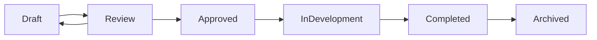

# PRD Management Command

Comprehensive Product Requirements Document management for your development workflow.

## Usage

```bash
/manage:prd <action> <prd-name> [options]
```

## Actions

### create
Create a new PRD from template
```bash
/manage:prd create "user-authentication" --template=api
/manage:prd create "dashboard-redesign" --template=frontend
```

### status
Check PRD status and location
```bash
/manage:prd status "user-authentication"
```

### approve
Approve PRD and trigger SDLC pipeline
```bash
/manage:prd approve "user-authentication"
# Automatically initiates: /sdlc "user-authentication" --init --from-prd
```

### move
Move PRD between states
```bash
/manage:prd move "user-authentication" --to=review
/manage:prd move "dashboard-redesign" --to=approved
```

### list
List all PRDs by status
```bash
/manage:prd list --status=draft
/manage:prd list --status=approved
/manage:prd list --all
```

### archive
Archive completed PRD
```bash
/manage:prd archive "user-authentication"
```

## Options

- `--template`: Template type (standard, api, frontend, fullstack)
- `--status`: Filter by status (draft, review, approved, in-development, archived)
- `--to`: Target state for move action
- `--auto-translate`: Enable automatic Korean to English translation
- `--from-prd`: Link to existing PRD for SDLC initialization

## PRD Lifecycle States



## File Organization

PRDs are organized in the following structure:
```
docs/prd/
├── draft/          # New PRDs being written
├── review/         # PRDs under review
├── approved/       # PRDs ready for development
├── in-development/ # PRDs currently being implemented
└── archived/       # Completed PRDs
    └── YYYY/MM/    # Organized by completion date
```

## Integration with SDLC

When a PRD is approved, it automatically:
1. Moves to `docs/prd/approved/`
2. Triggers SDLC pipeline initialization
3. Converts requirements to development tasks
4. Sets up progress tracking

## Language Support

PRDs can be written in Korean or English:
- Korean PRDs are automatically translated to English
- Original Korean version is preserved as `{name}_original_ko.md`
- English version becomes the primary document

## Templates

Available templates optimize PRD creation:
- **standard**: General purpose features
- **api**: API endpoints and backend services
- **frontend**: UI/UX focused features
- **fullstack**: End-to-end features

## Examples

### Complete PRD Workflow
```bash
# 1. Create new PRD
/manage:prd create "payment-integration" --template=api

# 2. Move to review after completion
/manage:prd move "payment-integration" --to=review

# 3. Review using dedicated command
/support:prd-review "payment-integration"

# 4. Approve and start development
/manage:prd approve "payment-integration"

# 5. Check status during development
/manage:prd status "payment-integration"

# 6. Archive after completion
/manage:prd archive "payment-integration"
```

## Metadata Tracking

Each PRD maintains metadata:
```yaml
prd_metadata:
  id: PRD-2024-001
  created: 2024-01-15
  author: system
  status: draft
  template: api
  sdlc_link: payment-integration
  translation: 
    required: true
    source_lang: ko
```

## Best Practices

1. Always start with appropriate template
2. Complete all required sections before review
3. Include measurable success metrics
4. Define clear acceptance criteria
5. Link dependencies explicitly
6. Archive PRDs promptly after completion

## Error Handling

Common issues and solutions:
- **Missing template**: Falls back to standard template
- **Invalid state transition**: Shows valid next states
- **Translation failure**: Preserves original with warning
- **SDLC link broken**: Prompts for manual initialization