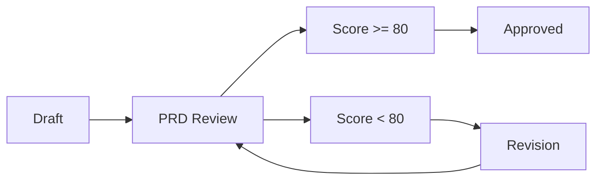

# PRD Review Command

Systematic review and validation of Product Requirements Documents to ensure quality and feasibility.

## Usage

```bash
/support:prd-review <prd-name> [options]
```

## Features

### Comprehensive Review
Analyzes PRD for:
- Completeness of all required sections
- Clarity and specificity of requirements
- Technical feasibility assessment
- Risk identification and mitigation
- Timeline and resource validation

### Automated Scoring
```yaml
Review Categories:
  Completeness: 30%  # All sections present
  Clarity: 25%       # Clear, unambiguous language
  Feasibility: 20%   # Technically achievable
  Testability: 15%   # Measurable criteria
  Risk Management: 10% # Identified and mitigated
```

### Review Output

Generates structured feedback report:
```markdown
## PRD Review: [Feature Name]

### Overall Assessment
- Score: 85/100
- Status: Requires Minor Revisions
- Readiness: Nearly Implementation-Ready

### Strengths
✅ Clear problem statement
✅ Well-defined success metrics

### Areas for Improvement
⚠️ Missing performance benchmarks
⚠️ Incomplete error scenarios

### Required Changes
1. Add specific latency targets
2. Document edge cases

### Technical Validation
- Feasibility: ✅ Confirmed
- Effort Estimate: 3-4 weeks
- Risk Level: Medium
```

## Options

- `--quick`: Fast review focusing on critical items only
- `--detailed`: Comprehensive analysis with code impact assessment
- `--auto-fix`: Automatically fix formatting and minor issues
- `--score-only`: Return numerical score without detailed feedback
- `--export`: Export review report to file

## Review Process

### 1. Structure Check
```bash
/support:prd-review "payment-integration" --quick
```
Validates presence of all required sections

### 2. Content Analysis
```bash
/support:prd-review "payment-integration" --detailed
```
Deep analysis including:
- Requirement specificity
- Acceptance criteria completeness
- Technical dependency mapping
- Performance impact assessment

### 3. Feasibility Assessment
Automatically:
- Analyzes code impact areas
- Estimates development effort
- Identifies integration challenges
- Validates against existing architecture

## Integration with PRD Workflow

### State Transitions


### Approval Criteria
- Minimum score: 80/100
- All critical sections complete
- No unmitigated high risks
- Clear acceptance criteria
- Feasibility confirmed

## Quality Gates

### Critical Requirements
Must have for approval:
- Problem statement
- Success metrics
- Functional requirements
- Acceptance criteria
- Timeline

### Recommended Elements
Should have for high score:
- User stories
- Non-functional requirements
- Risk mitigation plans
- Rollback procedures
- Monitoring strategy

## Common Issues Detected

### Language Issues
- Ambiguous terms: "should", "might", "nice to have"
- Missing specifics: "fast", "user-friendly", "scalable"
- Inconsistent terminology

### Technical Issues
- Unrealistic performance targets
- Missing error handling
- Incomplete API specifications
- Undefined data models

### Process Issues
- No rollback plan
- Missing dependencies
- Unrealistic timeline
- No success metrics

## Examples

### Basic Review
```bash
/support:prd-review "user-authentication"

# Output:
PRD Review Complete
Score: 75/100
Status: Revision Required
Key Issues: 
- Missing performance requirements
- Incomplete error scenarios
- Vague success metrics
```

### Detailed Review with Auto-fix
```bash
/support:prd-review "dashboard-redesign" --detailed --auto-fix

# Output:
PRD Review Complete
Score: 92/100 (improved from 85/100)
Status: Approved
Auto-fixed:
- Formatting issues
- Section numbering
- Link references
Remaining:
- Consider adding monitoring requirements
```

### Export Review Report
```bash
/support:prd-review "api-migration" --export

# Creates: docs/prd/reviews/api-migration-review-2024-01-15.md
```

## Review Checklist

Automated validation includes:
- [ ] All required sections present
- [ ] Requirements are SMART (Specific, Measurable, Achievable, Relevant, Time-bound)
- [ ] Technical specifications complete
- [ ] Dependencies identified
- [ ] Risks assessed with mitigation
- [ ] Timeline realistic
- [ ] Success metrics defined
- [ ] Acceptance criteria testable
- [ ] Rollback plan included
- [ ] Monitoring strategy defined

## Best Practices

1. Review PRDs iteratively - don't wait until fully complete
2. Focus on critical issues first
3. Provide constructive, actionable feedback
4. Use --auto-fix for formatting issues
5. Re-review after revisions
6. Document review decisions

## Error Handling

- **PRD not found**: Lists available PRDs
- **Invalid status**: PRD must be in draft or review state
- **Translation needed**: Automatically translates Korean PRDs before review
- **Incomplete PRD**: Provides guidance on missing sections