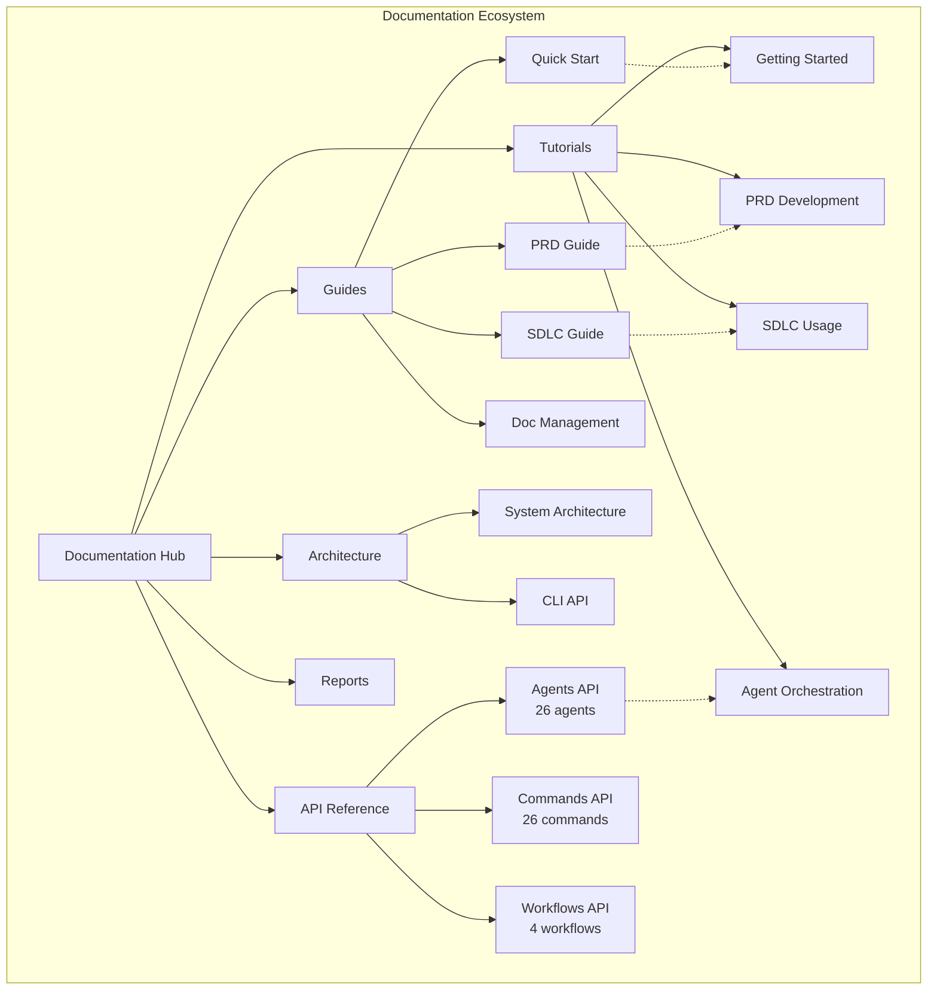

# Documentation Index

Welcome to the Context Engineering Template documentation. This directory contains comprehensive guides, technical documentation, and reports for the project.

## 📚 Document Categories

### 📖 Guides
User and developer guides for getting started and using the system effectively.

- **[Quick Start Guide](guides/QUICKSTART.md)** ([한국어](guides/QUICKSTART.ko.md)) - Get up and running in 5 minutes
- **[PRD Guide](guides/PRD_GUIDE.md)** ([한국어](guides/PRD_GUIDE.ko.md)) - Product Requirements Document system guide
- **[SDLC Pipeline Guide](guides/SDLC_GUIDE.md)** ([한국어](guides/SDLC_GUIDE.ko.md)) - Comprehensive SDLC pipeline documentation
- **[Document Management Guide](guides/DOCUMENT_MANAGEMENT.md)** ([한국어](guides/DOCUMENT_MANAGEMENT.ko.md)) - Documentation system guide

### 🏗️ Architecture
Technical documentation about system design and implementation.

- **[Architecture Overview](architecture/ARCHITECTURE.md)** ([한국어](architecture/ARCHITECTURE.ko.md)) - System architecture and design patterns
- **[API Documentation](architecture/API.md)** ([한국어](architecture/API.ko.md)) - API reference and usage guide

### 📚 API Reference
Complete API documentation for agents, commands, and workflows.

- **[API Index](api/index.md)** - Complete API reference index
- **[AI Agents API](api/agents.md)** - 26 specialized AI agents reference
- **[Commands API](api/commands.md)** - Command reference and usage
- **[Workflows API](api/workflows.md)** - Workflow orchestration reference

### 🎓 Tutorials
Step-by-step tutorials for mastering the system.

- **[Getting Started](tutorials/getting-started.md)** - Your first project in 10 minutes
- **[PRD Development](tutorials/prd-development.md)** - Building effective PRDs
- **[SDLC Pipeline Usage](tutorials/sdlc-pipeline-usage.md)** - Mastering the 7-phase pipeline
- **[Agent Orchestration](tutorials/agent-orchestration.md)** - Best practices for agent coordination

### 📊 Reports
Analysis reports and benchmarks.

- **[Benchmark Report](reports/BENCHMARK_REPORT.md)** ([한국어](reports/BENCHMARK_REPORT.ko.md)) - Performance benchmark results

## 🔍 Quick Navigation

### By Topic
- **Getting Started**: [Quick Start](guides/QUICKSTART.md) → [Getting Started Tutorial](tutorials/getting-started.md) → [Architecture](architecture/ARCHITECTURE.md)
- **Development Workflow**: [PRD Guide](guides/PRD_GUIDE.md) → [PRD Tutorial](tutorials/prd-development.md) → [SDLC Pipeline](guides/SDLC_GUIDE.md) → [SDLC Tutorial](tutorials/sdlc-pipeline-usage.md)
- **Technical Reference**: [API Index](api/index.md) → [Agents API](api/agents.md) → [Commands API](api/commands.md) → [Workflows API](api/workflows.md)
- **AI Orchestration**: [Agent Overview](api/agents.md) → [Agent Orchestration Tutorial](tutorials/agent-orchestration.md) → [Workflow Patterns](api/workflows.md)
- **Documentation**: [Doc Management Guide](guides/DOCUMENT_MANAGEMENT.md) → [Architecture](architecture/ARCHITECTURE.md)

### By Language
- **English**: All documents without `.ko.md` extension
- **한국어**: All documents with `.ko.md` extension

## 📝 Documentation Standards

### File Naming Convention
- English (default): `{DOCUMENT_NAME}.md`
- Korean version: `{DOCUMENT_NAME}.ko.md`

### Document Structure
```
docs/
├── README.md                    # This index file
├── guides/                      # User and developer guides
│   ├── QUICKSTART.md/ko.md
│   ├── PRD_GUIDE.md/ko.md
│   ├── SDLC_GUIDE.md/ko.md
│   └── DOCUMENT_MANAGEMENT.md/ko.md
├── architecture/                # Technical documentation
│   ├── ARCHITECTURE.md/ko.md
│   └── API.md/ko.md
├── api/                         # API reference documentation
│   ├── index.md                # API index
│   ├── agents.md               # Agents API
│   ├── commands.md             # Commands API
│   └── workflows.md            # Workflows API
├── tutorials/                   # Step-by-step tutorials
│   ├── getting-started.md
│   ├── prd-development.md
│   ├── sdlc-pipeline-usage.md
│   └── agent-orchestration.md
└── reports/                     # Analysis and benchmark reports
    └── BENCHMARK_REPORT.md/ko.md
```

## 📊 Documentation Overview



### Version Synchronization
All documentation must be maintained in both English and Korean versions. When updating any document, ensure both language versions are synchronized.

## 🔄 Recent Updates

- **2025-01-17**: Documentation structure reorganized for better navigation
- **2025-01-17**: Architecture guide updated to reflect monorepo structure
- **2025-01-17**: Korean versions added for all documents

## 📮 Contributing to Documentation

When contributing to documentation:
1. Update both English and Korean versions
2. Follow the established structure
3. Include examples where applicable
4. Update this index if adding new documents
5. Ensure all links are working

For more information on contributing, see [CONTRIBUTING.md](../CONTRIBUTING.md).