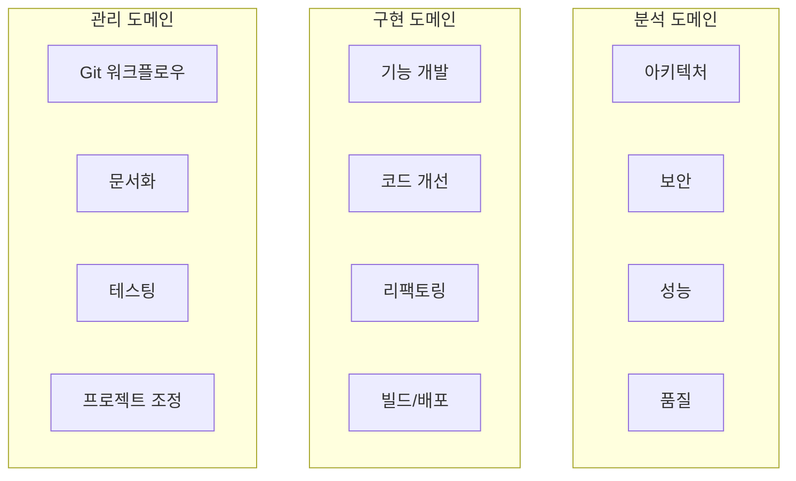

# API 참조 인덱스

## Context Engineering Template을 위한 포괄적인 API 문서

이 인덱스는 Context Engineering Template의 모든 API 참조에 대한 중앙 액세스 포인트를 제공합니다. 전체 AI 에이전트, 명령 및 워크플로우 시스템을 포괄합니다.

## 목차

- [빠른 시작](#빠른-시작)
- [핵심 API](#핵심-api)
- [에이전트 기능 매트릭스](#에이전트-기능-매트릭스)
- [명령 카테고리](#명령-카테고리)
- [워크플로우 시스템](#워크플로우-시스템)
- [통합 포인트](#통합-포인트)
- [성능 벤치마크](#성능-벤치마크)
- [API 버전 관리](#api-버전-관리)

## 빠른 시작

### 즉시 액세스
프로젝트에서 사용 가능한 핵심 API 구성요소:

```bash
# 26개 AI 에이전트
ls .claude/agents/

# 26개 명령
ls .claude/commands/

# 4개 워크플로우
ls .claude/workflows/
```

### 필수 링크
- **[AI 에이전트 API](agents.ko.md)** - 26개 전문 에이전트
- **[명령 API](commands.ko.md)** - 26개 개발 명령
- **[워크플로우 API](workflows.ko.md)** - 오케스트레이션 시스템

## 핵심 API

### AI 에이전트 (26개)

#### 분석 에이전트 (6개)
| 에이전트 | 목적 | 주요 도구 |
|---------|--------|-----------|
| `architecture-analyzer` | 시스템 아키텍처 분석 | Read, Grep, Bash |
| `security-analyzer` | 보안 취약점 식별 | Read, Grep, Bash |
| `performance-analyzer` | 성능 병목 현상 감지 | Read, Bash, BashOutput |
| `code-quality-analyzer` | 코드 품질 평가 | Read, Grep, TodoWrite |
| `project-context-analyzer` | 프로젝트 구조 이해 | Read, Glob, Grep |
| `claude-code-structure-auditor` | Claude Code 표준 검증 | Read, Glob, Bash |

#### 구현 에이전트 (8개)
| 에이전트 | 목적 | 주요 도구 |
|---------|--------|-----------|
| `feature-implementer` | 새 기능 구현 | Write, Edit, Task |
| `code-enhancement-specialist` | 코드 개선 | Edit, MultiEdit |
| `code-cleanup-optimizer` | 코드베이스 정리 | Write, Edit, Bash |
| `task-orchestrator` | 작업 조정 | Task, TodoWrite |
| `workflow-orchestrator` | 워크플로우 관리 | Task, Bash, Grep |
| `prd-workflow-generator` | PRD를 워크플로우로 변환 | Read, Write, Task |
| `sdlc-coordinator` | SDLC 파이프라인 조정 | Task, Bash, Glob |
| `build-packager` | 빌드 및 패키징 | Bash, Write, Edit |

#### 관리 에이전트 (7개)
| 에이전트 | 목적 | 주요 도구 |
|---------|--------|-----------|
| `git-workflow-manager` | Git 작업 자동화 | Bash, Write, Edit |
| `doc-manager` | 문서 관리 | Write, Edit, MultiEdit |
| `project-knowledge-curator` | 지식 베이스 생성 | Write, Edit, Glob |
| `test-execution-manager` | 테스트 실행 | Bash, Write, Edit |
| `dev-estimator` | 개발 시간 추정 | Read, Glob, Grep |
| `issue-diagnostician` | 문제 진단 | Read, Bash, BashOutput |
| `concept-explainer` | 개념 설명 | Read, Glob, Grep |

#### 지원 에이전트 (5개)
| 에이전트 | 목적 | 주요 도구 |
|---------|--------|-----------|
| `agent-prompt-reviewer` | 에이전트 품질 평가 | Read, Grep, TodoWrite |
| `focused-doc-generator` | 대상 문서 생성 | Write, Edit, Grep |
| 추가 전문 헬퍼 | 다양한 지원 작업 | 작업별 도구 |

### 명령 (26개)

#### 카테고리별 분류
```
분석 (5개):   code-quality, performance, project-context, 
             sdlc-readiness, security

구현 (5개):   enhancement, feature, fix, refactor, sdlc-phase

관리 (6개):   docs, git, prd, sdlc-pipeline, test, workflow

지원 (10개):  agent-review, claude-structure-audit, concept-explain,
             issue-diagnose, prd-review, sdlc-report, 등
```

### 워크플로우 (4개)

| 워크플로우 | 목적 | 일반 기간 |
|-----------|------|-----------|
| `development-lifecycle` | 전체 개발 라이프사이클 | 10-15일 |
| `quality-assurance` | 품질 검사 및 검증 | 4-6시간 |
| `prd-to-implementation` | PRD를 코드로 변환 | 가변 |
| `issue-resolution` | 긴급 문제 해결 | 30분-4시간 |

## 에이전트 기능 매트릭스

### 도구 액세스 매트릭스
| 기능 | 분석 | 구현 | 관리 | 지원 |
|------|------|------|------|------|
| **파일 읽기** | ✅ | ✅ | ✅ | ✅ |
| **파일 쓰기** | ❌ | ✅ | ✅ | ✅ |
| **코드 편집** | ❌ | ✅ | ✅ | ⚠️ |
| **Bash 실행** | ✅ | ✅ | ✅ | ✅ |
| **작업 관리** | ✅ | ✅ | ✅ | ✅ |
| **에이전트 호출** | ❌ | ✅ | ✅ | ❌ |

### 전문 영역


## 명령 카테고리

### 분석 명령
```bash
/analyze:code-quality [path]        # 코드 품질 메트릭
/analyze:performance [path]          # 성능 분석
/analyze:project-context [path]      # 프로젝트 개요
/analyze:sdlc-readiness              # SDLC 준비 상태
/analyze:security [path]             # 보안 감사
```

### 구현 명령
```bash
/implement:enhancement [component]   # 코드 개선
/implement:feature [name]           # 새 기능
/implement:fix [issue]              # 버그 수정
/implement:refactor [component]     # 리팩토링
/implement:sdlc-phase [feature]     # SDLC 단계 실행
```

### 관리 명령
```bash
/manage:docs [action]               # 문서 관리
/manage:git [action]                # Git 작업
/manage:prd [action] [name]         # PRD 라이프사이클
/manage:sdlc-pipeline [action]      # 파이프라인 관리
/manage:test [scope]                # 테스트 실행
```

### 지원 명령
```bash
/support:agent-review [agent]       # 에이전트 품질 검토
/support:claude-structure-audit     # 프로젝트 구조 감사
/support:concept-explain [concept]  # 개념 설명
/support:issue-diagnose [error]     # 문제 진단
/support:prd-review [name]          # PRD 품질 검토
/support:sdlc-report [pipeline]     # SDLC 보고서
```

## 워크플로우 시스템

### 워크플로우 실행 모드
| 모드 | 설명 | 사용 사례 |
|------|------|-----------|
| **순차** | 단계를 순서대로 실행 | 의존성이 있는 작업 |
| **병렬** | 동시에 여러 단계 실행 | 독립적인 작업 |
| **조건부** | 조건에 따라 단계 실행 | 적응형 워크플로우 |
| **하이브리드** | 모드 결합 | 복잡한 시나리오 |

### 워크플로우 오케스트레이션
```yaml
# 예제: 병렬 실행 구성
workflow: parallel-analysis
config:
  parallel_execution: true
  max_concurrent: 3
phases:
  - name: analysis
    agents:
      - security-analyzer
      - performance-analyzer
      - architecture-analyzer
    parallel: true
```

## 통합 포인트

### CI/CD 통합
```yaml
# GitHub Actions 예제
- uses: claude-code/action@v1
  with:
    command: /analyze:code-quality
    path: src/
```

### API 엔드포인트
```javascript
// 프로그래밍 방식 액세스
const api = require('@claude-code/api');

// 에이전트 실행
await api.agents.execute('feature-implementer', {
  task: 'implement user authentication'
});

// 명령 실행
await api.commands.run('/analyze:security', {
  path: 'src/',
  verbose: true
});

// 워크플로우 트리거
await api.workflows.trigger('development-lifecycle', {
  feature: 'payment-processing'
});
```

### 웹훅 및 이벤트
```javascript
// 이벤트 리스너
api.on('agent:complete', (result) => {
  console.log(`에이전트 완료: ${result.agent}`);
});

api.on('workflow:phase:complete', (phase) => {
  console.log(`단계 완료: ${phase.name}`);
});
```

## 성능 벤치마크

### 에이전트 성능 메트릭
| 에이전트 유형 | 평균 실행 시간 | 메모리 사용량 | 성공률 |
|--------------|---------------|-------------|--------|
| 분석 | 30-60초 | 128-256MB | 98% |
| 구현 | 2-5분 | 256-512MB | 95% |
| 관리 | 1-3분 | 128-256MB | 99% |
| 지원 | 15-45초 | 64-128MB | 99% |

### 워크플로우 성능
| 워크플로우 | 일반 기간 | 리소스 사용량 | 병렬화 이득 |
|-----------|-----------|--------------|-------------|
| development-lifecycle | 10-15일 | 높음 | 30-40% |
| quality-assurance | 4-6시간 | 중간 | 50-60% |
| prd-to-implementation | 가변 | 높음 | 20-30% |
| issue-resolution | 30분-4시간 | 낮음 | 최소 |

### 최적화 권장사항
1. **병렬 실행**: 독립적인 작업에 병렬 에이전트 사용
2. **캐싱**: 반복 분석 결과 캐시
3. **배치 처리**: 유사한 작업 그룹화
4. **리소스 제한**: 에이전트당 메모리 제한 설정

## API 버전 관리

### 현재 버전
- **API 버전**: 1.0.0
- **안정성**: 프로덕션 준비 완료
- **호환성**: Claude Code 2.0+

### 버전 정책
```javascript
// 버전 확인
const version = api.version;
console.log(`API 버전: ${version.major}.${version.minor}.${version.patch}`);

// 호환성 확인
if (api.isCompatible('1.0.0')) {
  // API 호출 실행
}
```

### 사용 중단 정책
- **알림 기간**: 3개월
- **지원 기간**: 6개월
- **마이그레이션 가이드**: 제공됨

## 고급 기능

### 사용자 정의 에이전트
```javascript
// 사용자 정의 에이전트 등록
api.agents.register({
  name: 'custom-analyzer',
  tools: ['Read', 'Grep'],
  handler: async (task) => {
    // 사용자 정의 로직
  }
});
```

### 워크플로우 확장
```yaml
# 사용자 정의 워크플로우
name: custom-workflow
extends: development-lifecycle
overrides:
  phases:
    - name: custom-phase
      agents: [custom-analyzer]
```

### 플러그인 시스템
```javascript
// 플러그인 로드
api.plugins.load('@company/custom-plugin');

// 플러그인 사용
await api.plugins.execute('custom-command');
```

## 문제 해결

### 일반적인 API 오류
| 오류 코드 | 설명 | 해결 방법 |
|----------|------|-----------|
| API001 | 에이전트를 찾을 수 없음 | 에이전트 이름 확인 |
| API002 | 명령 실행 실패 | 명령 구문 확인 |
| API003 | 워크플로우 시간 초과 | 시간 초과 증가 |
| API004 | 리소스 고갈 | 리소스 제한 조정 |

### 디버그 모드
```bash
# API 디버깅 활성화
CLAUDE_API_DEBUG=true
CLAUDE_API_VERBOSE=true
```

## 빠른 참조

### 가장 많이 사용되는 에이전트
1. `feature-implementer` - 새 기능 개발
2. `code-quality-analyzer` - 코드 품질 확인
3. `test-execution-manager` - 테스트 실행
4. `git-workflow-manager` - Git 작업
5. `doc-manager` - 문서 관리

### 가장 많이 사용되는 명령
1. `/implement:feature` - 기능 구현
2. `/analyze:code-quality` - 품질 분석
3. `/manage:git commit` - 커밋 생성
4. `/manage:test all` - 모든 테스트 실행
5. `/support:issue-diagnose` - 문제 해결

### 필수 워크플로우
1. `development-lifecycle` - 전체 개발 프로세스
2. `quality-assurance` - 품질 보증
3. `issue-resolution` - 빠른 수정

## 추가 리소스

### 내부 문서
- [아키텍처 개요](../architecture/ARCHITECTURE.ko.md)
- [빠른 시작 가이드](../guides/QUICKSTART.ko.md)
- 
### 튜토리얼
- [PRD 개발 튜토리얼](../tutorials/prd-development.ko.md)
- [SDLC 파이프라인 사용법](../tutorials/sdlc-pipeline-usage.ko.md)
- [에이전트 오케스트레이션](../tutorials/agent-orchestration.ko.md)

### 가이드
- [SDLC 가이드](../guides/SDLC_GUIDE.ko.md)
- [PRD 가이드](../guides/PRD_GUIDE.ko.md)
- [문서 관리 가이드](../guides/DOCUMENT_MANAGEMENT.ko.md)

### 외부 링크
- [Claude Code 문서](https://docs.anthropic.com/claude-code)
- [GitHub 저장소](https://github.com/your-org/context-engineering-template)
- [커뮤니티 포럼](https://community.claude.ai)

## 요약

Context Engineering Template API는 다음을 제공합니다:
- **26개 전문 AI 에이전트** - 다양한 개발 작업용
- **26개 명령** - 일반 작업 자동화
- **4개 핵심 워크플로우** - 복잡한 프로세스 오케스트레이션
- **포괄적인 통합** - CI/CD, API, 웹훅
- **프로덕션 준비 완료** - 검증되고 최적화됨

모든 구성요소는 원활하게 함께 작동하도록 설계되어 강력하고 효율적인 개발 환경을 제공합니다.