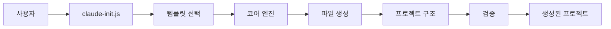
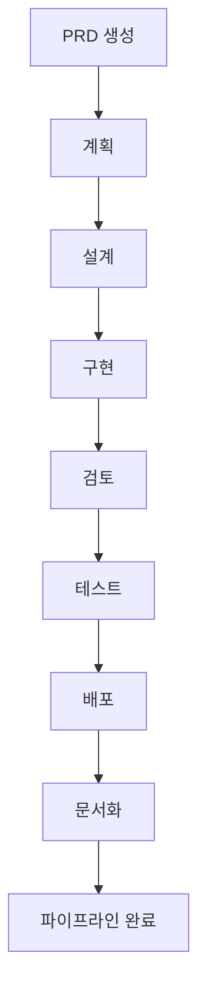
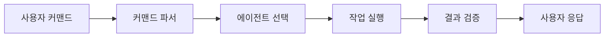

# 아키텍처 가이드

## 시스템 개요

Context Engineering Template은 AI 기반 개발 지원, 구조화된 워크플로우, 이중 언어 문서화 지원을 통해 Claude Code 프로젝트를 생성하고 관리하도록 설계된 정교한 모노레포(monorepo) 시스템입니다.

## 핵심 아키텍처

### 1. 모노레포 구조

```
context-engineering-template/
├── packages/                      # 모듈형 패키지
│   └── @claude-code/
│       ├── agents/               # AI 에이전트 정의
│       │   └── src/             # 25개의 전문 에이전트
│       ├── commands/             # 커맨드 템플릿
│       │   └── src/             # 26개의 Claude Code 커맨드
│       ├── workflows/            # 워크플로우 정의
│       │   └── src/             # 4개의 워크플로우 패턴
│       └── core/                 # 핵심 유틸리티
│           └── src/             # 템플릿 엔진 및 도구
├── starters/                     # 프로젝트 템플릿
│   ├── basic/                   # 기본 스타터 템플릿
│   ├── api/                     # API 서버 템플릿
│   ├── frontend/                # 프론트엔드 앱 템플릿
│   └── fullstack/               # 풀스택 템플릿
├── cli/                         # CLI 도구
│   └── claude-init.js          # 프로젝트 초기화 도구
├── docs/                        # 문서
└── .github/                     # CI/CD 워크플로우
```

### 2. 패키지 시스템 (`packages/@claude-code/`)

#### 에이전트 패키지 (Agents Package)
- **위치**: `packages/@claude-code/agents/src/`
- **목적**: 특수 작업을 위한 AI 에이전트 정의
- **개수**: 25개 에이전트
- **카테고리**:
  - 분석: architecture, security, performance, code-quality 분석기
  - 구현: feature-implementer, code-enhancement-specialist, code-cleanup-optimizer
  - 관리: git-workflow-manager, sdlc-coordinator, workflow-orchestrator
  - 지원: issue-diagnostician, concept-explainer, doc-manager

#### 커맨드 패키지 (Commands Package)
- **위치**: `packages/@claude-code/commands/src/`
- **목적**: Claude Code 커맨드 템플릿
- **개수**: 26개 커맨드
- **카테고리**:
  - `/analyze:*` - 시스템 분석 커맨드
  - `/implement:*` - 기능 구현 커맨드
  - `/manage:*` - 프로젝트 관리 커맨드
  - `/support:*` - 개발 지원 커맨드

#### 워크플로우 패키지 (Workflows Package)
- **위치**: `packages/@claude-code/workflows/src/`
- **목적**: 개발 워크플로우 패턴
- **개수**: 4개 워크플로우
- **종류**:
  - development-lifecycle.md
  - prd-lifecycle.md
  - quality-assurance.md
  - sdlc-pipeline.md

#### 코어 패키지 (Core Package)
- **위치**: `packages/@claude-code/core/src/`
- **목적**: 핵심 유틸리티 및 엔진
- **구성요소**:
  - 템플릿 생성 엔진
  - 프로젝트 검증 도구
  - 문서 동기화
  - PRD 번역 유틸리티

### 3. 스타터 템플릿 (`starters/`)

각 스타터 템플릿 구조:
```
starter-name/
├── .claude/                     # Claude Code 설정
│   ├── agents/                 # 선택된 AI 에이전트
│   ├── commands/               # 사용 가능한 커맨드
│   ├── workflows/              # 워크플로우 정의
│   └── sdlc/                   # SDLC 파이프라인 설정
├── docs/                       # 프로젝트 문서
│   ├── guides/                 # 사용자 가이드
│   ├── architecture/           # 기술 문서
│   └── templates/              # 문서 템플릿
├── CLAUDE.md                   # AI 어시스턴트 지침
└── README.md/ko.md            # 이중 언어 문서
```

### 4. CLI 시스템 (`cli/`)

#### 프로젝트 초기화 도구
- **파일**: `cli/claude-init.js`
- **목적**: 새로운 Claude Code 프로젝트 생성
- **기능**:
  - 템플릿 선택 (basic, api, frontend, fullstack)
  - SDLC 파이프라인 통합
  - PRD 시스템 설정
  - 이중 언어 문서 설정

### 5. 문서 시스템 (`docs/`)

#### 구조
```
docs/
├── guides/                      # 사용자 가이드
│   ├── QUICKSTART.md/ko.md
│   ├── PRD_GUIDE.md/ko.md
│   └── SDLC_GUIDE.md/ko.md
├── architecture/                # 기술 문서
│   ├── ARCHITECTURE.md/ko.md
│   └── API.md/ko.md
└── reports/                     # 분석 리포트
    └── BENCHMARK_REPORT.md/ko.md
```

## 데이터 플로우 아키텍처

### 1. 프로젝트 생성 플로우


### 2. SDLC 파이프라인 플로우


### 3. 커맨드 실행 플로우


## 주요 컴포넌트

### 1. 에이전트 시스템
- **목적**: 특정 작업을 위한 전문 AI 어시스턴트
- **아키텍처**: 마크다운 기반 프롬프트 정의
- **통합**: `.claude/agents/`를 통한 직접 Claude Code 인식
- **활성화**: 커맨드 기반 또는 컨텍스트 기반 자동 활성화

### 2. 커맨드 시스템
- **목적**: 구조화된 작업 실행
- **형식**: `/category:action [parameters]`
- **처리**: 커맨드 파서 → 에이전트 선택 → 실행
- **카테고리**: analyze, implement, manage, support

### 3. 워크플로우 시스템
- **목적**: 다단계 개발 프로세스
- **유형**: 순차적, 병렬, 반복적
- **통합**: SDLC 단계, PRD 라이프사이클
- **자동화**: 품질 게이트, 자동 진행

### 4. PRD 시스템
- **목적**: 요구사항 중심 개발
- **플로우**: 생성 → 검토 → 승인 → SDLC
- **기능**: 자동 번역, 템플릿, 검증
- **통합**: 직접 SDLC 파이프라인 트리거

### 5. 문서 시스템
- **목적**: 이중 언어 프로젝트 문서
- **구조**: 카테고리별 계층 구조
- **자동화**: 동기화 검증, 참조 확인
- **표준**: 영어/한국어 동등성 요구사항

## 기술 스택

### 핵심 기술
- **런타임**: Node.js (>= 16.0.0)
- **패키지 매니저**: npm with workspaces
- **버전 관리**: Git
- **CI/CD**: GitHub Actions

### 개발 도구
- **테스팅**: Jest
- **린팅**: ESLint (계획됨)
- **문서화**: Markdown
- **자동화**: Bash 스크립트, Node.js 스크립트

## 보안 아키텍처

### 1. 입력 검증
- 커맨드 매개변수 정제
- 파일 경로 검증
- 템플릿 인젝션 방지

### 2. 파일 시스템 안전성
- 제한된 디렉토리 접근
- 안전한 파일 작업
- 권한 확인

### 3. 코드 생성 보안
- 템플릿 정제
- eval() 또는 동적 코드 실행 금지
- 보안 기본값

## 성능 고려사항

### 1. 모노레포 최적화
- 공유 의존성을 위한 워크스페이스 호이스팅
- 선택적 패키지 설치
- 증분 빌드

### 2. 템플릿 생성
- 템플릿의 지연 로딩
- 병렬 파일 작업
- 공통 리소스 캐싱

### 3. 문서화
- 가벼운 마크다운 처리
- 효율적인 파일 검색
- 인덱싱된 참조 시스템

## 확장 포인트

### 1. 새 에이전트 추가
- `packages/@claude-code/agents/src/`에 마크다운 파일 생성
- 기능 및 프롬프트 정의
- 문서에서 에이전트 개수 업데이트

### 2. 새 커맨드 추가
- `packages/@claude-code/commands/src/`에 커맨드 파일 생성
- 매개변수 및 실행 정의
- 커맨드 시스템에 등록

### 3. 새 스타터 생성
- `starters/` 아래에 디렉토리 추가
- 필수 구조 포함
- 특정 기능 구성

### 4. 워크플로우 확장
- `packages/@claude-code/workflows/src/`에 워크플로우 정의 추가
- 단계 및 품질 게이트 정의
- 기존 시스템과 통합

## 통합 포인트

### 1. Claude Code 통합
- `.claude/` 디렉토리를 통한 직접 파일 시스템 접근
- Settings.json 구성
- 에이전트 및 커맨드 인식

### 2. 버전 관리 통합
- 검증을 위한 Git hooks
- 자동화된 커밋 메시지
- 브랜치 관리

### 3. CI/CD 통합
- GitHub Actions 워크플로우
- 자동화된 테스팅
- 문서 검증

## 모범 사례

### 1. 개발
- 모노레포 규칙 준수
- 이중 언어 문서 유지
- 시맨틱 버저닝 사용
- 포괄적인 테스트 작성

### 2. 문서화
- 영어/한국어 동기화 유지
- 코드 변경과 함께 업데이트
- 예제 포함
- 메타데이터 유지

### 3. 테스팅
- 모든 유틸리티 단위 테스트
- 워크플로우 통합 테스트
- 생성된 프로젝트 검증
- 문서 링크 확인

## 향후 아키텍처 계획

### 1. 플러그인 시스템
- 동적 에이전트 로딩
- 서드파티 커맨드 지원
- 커스텀 워크플로우 정의

### 2. 클라우드 통합
- 원격 템플릿 저장소
- 협업 기능
- 분석 및 메트릭

### 3. 향상된 자동화
- AI 기반 문서 생성
- 자동 코드 리뷰
- 지능형 리팩토링 제안

---

이 아키텍처 가이드는 현재 모노레포 구조를 반영하며 시스템이 발전함에 따라 업데이트될 것입니다.