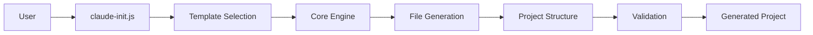
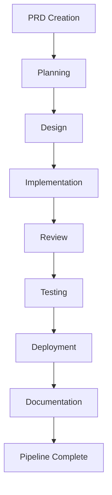
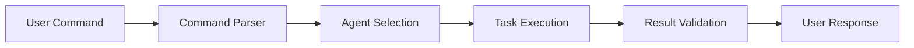

# Architecture Guide

## System Overview

The Context Engineering Template is a sophisticated monorepo system designed to generate and manage Claude Code projects with AI-powered development assistance, structured workflows, and bilingual documentation support.

## Core Architecture

### 1. Monorepo Structure

```
context-engineering-template/
├── packages/                      # Modular packages
│   └── @claude-code/
│       ├── agents/               # AI agent definitions
│       │   └── src/             # 25 specialized agents
│       ├── commands/             # Command templates
│       │   └── src/             # 26 Claude Code commands
│       ├── workflows/            # Workflow definitions
│       │   └── src/             # 4 workflow patterns
│       └── core/                 # Core utilities
│           └── src/             # Template engine & tools
├── starters/                     # Project templates
│   ├── basic/                   # Basic starter template
│   ├── api/                     # API server template
│   ├── frontend/                # Frontend app template
│   └── fullstack/               # Full-stack template
├── cli/                         # CLI tools
│   └── claude-init.js          # Project initialization tool
├── docs/                        # Documentation
└── .github/                     # CI/CD workflows
```

### 2. Package System (`packages/@claude-code/`)

#### Agents Package
- **Location**: `packages/@claude-code/agents/src/`
- **Purpose**: AI agent definitions for specialized tasks
- **Count**: 25 agents
- **Categories**:
  - Analysis: architecture, security, performance, code-quality analyzers
  - Implementation: feature-implementer, code-enhancement-specialist, code-cleanup-optimizer
  - Management: git-workflow-manager, sdlc-coordinator, workflow-orchestrator
  - Support: issue-diagnostician, concept-explainer, doc-manager

#### Commands Package
- **Location**: `packages/@claude-code/commands/src/`
- **Purpose**: Claude Code command templates
- **Count**: 26 commands
- **Categories**:
  - `/analyze:*` - System analysis commands
  - `/implement:*` - Feature implementation commands
  - `/manage:*` - Project management commands
  - `/support:*` - Development support commands

#### Workflows Package
- **Location**: `packages/@claude-code/workflows/src/`
- **Purpose**: Development workflow patterns
- **Count**: 4 workflows
- **Types**:
  - development-lifecycle.md
  - prd-lifecycle.md
  - quality-assurance.md
  - sdlc-pipeline.md

#### Core Package
- **Location**: `packages/@claude-code/core/src/`
- **Purpose**: Core utilities and engine
- **Components**:
  - Template generation engine
  - Project validation tools
  - Documentation synchronization
  - PRD translation utilities

### 3. Starter Templates (`starters/`)

Each starter template provides:
```
starter-name/
├── .claude/                     # Claude Code configuration
│   ├── agents/                 # Selected AI agents
│   ├── commands/               # Available commands
│   ├── workflows/              # Workflow definitions
│   └── sdlc/                   # SDLC pipeline config
├── docs/                       # Project documentation
│   ├── guides/                 # User guides
│   ├── architecture/           # Technical docs
│   └── templates/              # Document templates
├── CLAUDE.md                   # AI assistant instructions
└── README.md/ko.md            # Bilingual documentation
```

### 4. CLI System (`cli/`)

#### Project Initializer
- **File**: `cli/claude-init.js`
- **Purpose**: Create new Claude Code projects
- **Features**:
  - Template selection (basic, api, frontend, fullstack)
  - SDLC pipeline integration
  - PRD system configuration
  - Bilingual documentation setup

### 5. Documentation System (`docs/`)

#### Structure
```
docs/
├── guides/                      # User guides
│   ├── QUICKSTART.md/ko.md
│   ├── PRD_GUIDE.md/ko.md
│   └── SDLC_GUIDE.md/ko.md
├── architecture/                # Technical documentation
│   ├── ARCHITECTURE.md/ko.md
│   └── API.md/ko.md
└── reports/                     # Analysis reports
    └── BENCHMARK_REPORT.md/ko.md
```

## Data Flow Architecture

### 1. Project Generation Flow


### 2. SDLC Pipeline Flow


### 3. Command Execution Flow


## Key Components

### 1. Agent System
- **Purpose**: Specialized AI assistants for specific tasks
- **Architecture**: Markdown-based prompt definitions
- **Integration**: Direct Claude Code recognition via `.claude/agents/`
- **Activation**: Command-based or automatic based on context

### 2. Command System
- **Purpose**: Structured task execution
- **Format**: `/category:action [parameters]`
- **Processing**: Command parser → Agent selection → Execution
- **Categories**: analyze, implement, manage, support

### 3. Workflow System
- **Purpose**: Multi-step development processes
- **Types**: Sequential, parallel, iterative
- **Integration**: SDLC phases, PRD lifecycle
- **Automation**: Quality gates, automatic progression

### 4. PRD System
- **Purpose**: Requirements-driven development
- **Flow**: Creation → Review → Approval → SDLC
- **Features**: Automatic translation, templates, validation
- **Integration**: Direct SDLC pipeline trigger

### 5. Documentation System
- **Purpose**: Bilingual project documentation
- **Structure**: Hierarchical with categories
- **Automation**: Sync validation, reference checking
- **Standards**: English/Korean parity requirement

## Technology Stack

### Core Technologies
- **Runtime**: Node.js (>= 16.0.0)
- **Package Manager**: npm with workspaces
- **Version Control**: Git
- **CI/CD**: GitHub Actions

### Development Tools
- **Testing**: Jest
- **Linting**: ESLint (planned)
- **Documentation**: Markdown
- **Automation**: Bash scripts, Node.js scripts

## Security Architecture

### 1. Input Validation
- Command parameter sanitization
- File path validation
- Template injection prevention

### 2. File System Safety
- Restricted directory access
- Safe file operations
- Permission checking

### 3. Code Generation Security
- Template sanitization
- No eval() or dynamic code execution
- Secure defaults

## Performance Considerations

### 1. Monorepo Optimization
- Workspace hoisting for shared dependencies
- Selective package installation
- Incremental builds

### 2. Template Generation
- Lazy loading of templates
- Parallel file operations
- Caching of common resources

### 3. Documentation
- Lightweight markdown processing
- Efficient file searching
- Indexed reference system

## Extensibility Points

### 1. Adding New Agents
- Create markdown file in `packages/@claude-code/agents/src/`
- Define capabilities and prompts
- Update agent count in documentation

### 2. Adding New Commands
- Create command file in `packages/@claude-code/commands/src/`
- Define parameters and execution
- Register in command system

### 3. Creating New Starters
- Add directory under `starters/`
- Include required structure
- Configure specific features

### 4. Extending Workflows
- Add workflow definition in `packages/@claude-code/workflows/src/`
- Define phases and quality gates
- Integrate with existing systems

## Integration Points

### 1. Claude Code Integration
- Direct file system access via `.claude/` directory
- Settings.json configuration
- Agent and command recognition

### 2. Version Control Integration
- Git hooks for validation
- Automated commit messages
- Branch management

### 3. CI/CD Integration
- GitHub Actions workflows
- Automated testing
- Documentation validation

## Best Practices

### 1. Development
- Follow monorepo conventions
- Maintain bilingual documentation
- Use semantic versioning
- Write comprehensive tests

### 2. Documentation
- Keep English/Korean synchronized
- Update with code changes
- Include examples
- Maintain metadata

### 3. Testing
- Unit test all utilities
- Integration test workflows
- Validate generated projects
- Check documentation links

## Future Architecture Plans

### 1. Plugin System
- Dynamic agent loading
- Third-party command support
- Custom workflow definitions

### 2. Cloud Integration
- Remote template storage
- Collaborative features
- Analytics and metrics

### 3. Enhanced Automation
- AI-powered documentation generation
- Automatic code review
- Intelligent refactoring suggestions

---

This architecture guide reflects the current monorepo structure and will be updated as the system evolves.