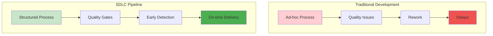
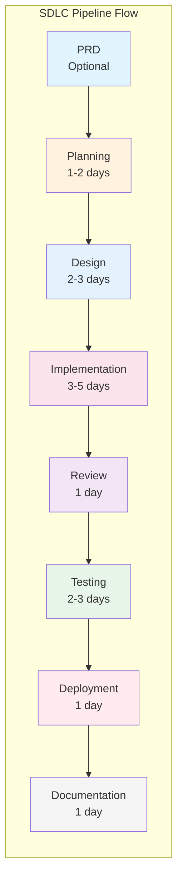

# SDLC Pipeline System Guide

## Table of Contents
1. [Overview & Philosophy](#overview--philosophy)
2. [Quick Start](#quick-start)
3. [Phase-by-Phase Guide](#phase-by-phase-guide)
4. [Template Deep Dive](#template-deep-dive)
5. [Quality Gates Management](#quality-gates-management)
6. [Advanced Features](#advanced-features)
7. [Best Practices](#best-practices)
8. [Troubleshooting](#troubleshooting)
9. [Case Studies](#case-studies)
10. [Reference](#reference)

## Overview & Philosophy

### What is SDLC Pipeline System?

The SDLC (Software Development Lifecycle) Pipeline System is an intelligent, automated framework that transforms ad-hoc development into structured, repeatable processes. It orchestrates your development workflow through 7 distinct phases, each with specialized AI agents, quality gates, and progress tracking.

### Core Philosophy

- **Structured Freedom**: Provides structure without rigidity
- **Quality by Design**: Built-in quality gates at every phase
- **Intelligent Automation**: AI agents handle routine tasks
- **Continuous Visibility**: Real-time progress and metrics
- **Flexible Adaptation**: Templates for different scenarios

### Why Use SDLC Pipeline?

Traditional development often suffers from:
- Inconsistent processes across projects
- Missing documentation
- Skipped testing phases
- Unclear progress visibility
- Quality issues discovered late

SDLC Pipeline solves these by:
- Enforcing consistent, proven processes
- Automating documentation generation
- Mandating quality checks at each phase
- Providing real-time progress tracking
- Catching issues early through phase gates



## Quick Start

### 10-Minute Tutorial

#### Step 1: Check Readiness
```bash
/analyze:sdlc-readiness
```
This ensures your project is ready for SDLC pipeline integration.

#### Step 2: Initialize Your First Pipeline
```bash
# Option A: Start directly with SDLC
/sdlc "my-feature" --init

# Option B: Start from an approved PRD (recommended)
/manage:prd create "my-feature" --template=standard
# ... write and refine PRD ...
/manage:prd approve "my-feature"  # This auto-starts SDLC
```

#### Step 3: Execute the Planning Phase
```bash
/sdlc "my-feature" --phase=planning
```
The system will guide you through requirements gathering.
Note: If started from PRD, requirements are auto-imported.

#### Step 4: Check Status
```bash
/sdlc "my-feature" --status
```
View your current phase and progress.

#### Step 5: Continue to Next Phase
```bash
/sdlc "my-feature" --continue
```
Automatically proceed to the design phase.

### Essential Commands

| Command | Purpose | Example |
|---------|---------|---------|
| `/sdlc --init` | Start new pipeline | `/sdlc "auth-system" --init` |
| `/sdlc --init --from-prd` | Start from PRD | `/sdlc "auth-system" --init --from-prd` |
| `/sdlc --status` | Check progress | `/sdlc "auth-system" --status` |
| `/sdlc --continue` | Next phase | `/sdlc "auth-system" --continue` |
| `/sdlc --full` | Run all phases | `/sdlc "auth-system" --full` |
| `/support:sdlc-report` | Generate report | `/support:sdlc-report "auth-system"` |

## Phase-by-Phase Guide



### Phase 0: PRD Creation (PRD 작성) - Optional

**Duration**: 1-2 days  
**Purpose**: Define product requirements before development

#### When to Use
- New features requiring clear specifications
- Complex projects with multiple stakeholders
- Projects needing approval before development
- When documentation trail is important

#### Key Activities
1. **Requirement Definition**
   - Write comprehensive PRD using templates
   - Define success metrics and KPIs
   - Specify functional and non-functional requirements
   
2. **Review & Refinement**
   - Submit PRD for review
   - Address feedback and iterate
   - Ensure completeness and clarity
   
3. **Approval Process**
   - Get stakeholder sign-off
   - Finalize requirements
   - Lock scope for development

#### Commands
```bash
# Create PRD
/manage:prd create "feature-name" --template=api

# Review PRD quality
/support:prd-review "feature-name"

# Approve and start SDLC
/manage:prd approve "feature-name"
```

#### Quality Gates
- [ ] PRD completeness score ≥ 80
- [ ] All requirements clearly defined
- [ ] Success metrics specified
- [ ] Stakeholder approval obtained

### Phase 1: Planning (계획)

**Duration**: 1-2 days  
**Purpose**: Define what needs to be built

#### Key Activities
1. **Requirements Analysis**
   - Gather functional requirements
   - Identify non-functional requirements
   - Define acceptance criteria
   
2. **Work Breakdown Structure**
   - Decompose features into tasks
   - Estimate effort for each task
   - Identify dependencies
   
3. **Resource Allocation**
   - Assign team members
   - Allocate time budgets
   - Plan milestones

#### Agent Support
- `project-knowledge-curator`: Documents requirements
- `dev-estimator`: Provides time estimates
- `task-orchestrator`: Creates task breakdown

#### Quality Gates
- [ ] All requirements documented
- [ ] Estimates reviewed and approved
- [ ] Resources allocated
- [ ] Risks identified

#### Example
```bash
# Start planning phase
/sdlc "payment-integration" --phase=planning

# The system will:
# 1. Prompt for requirements
# 2. Generate WBS
# 3. Estimate timelines
# 4. Create planning artifacts
```

### Phase 2: Design (설계)

**Duration**: 2-3 days  
**Purpose**: Define how to build it

#### Key Activities
1. **Architecture Design**
   - System architecture diagram
   - Component interactions
   - Technology stack decisions
   
2. **API Interface Definition**
   - Endpoint specifications
   - Request/response schemas
   - Authentication mechanisms
   
3. **Data Modeling**
   - Database schema design
   - Entity relationships
   - Data flow diagrams

#### Agent Support
- `system-architect`: Creates architecture
- `architecture-analyzer`: Reviews design
- `focused-doc-generator`: Documents APIs

#### Quality Gates
- [ ] Architecture reviewed
- [ ] API contracts defined
- [ ] Data model approved
- [ ] Security considerations addressed

#### Example
```bash
# Execute design phase
/sdlc "payment-integration" --phase=design

# Outputs:
# - architecture.md
# - api-specification.yaml
# - database-schema.sql
# - design-decisions.md
```

### Phase 3: Implementation (구현)

**Duration**: 3-5 days  
**Purpose**: Build the solution

#### Key Activities
1. **Code Development**
   - Feature implementation
   - Unit test creation
   - Code documentation
   
2. **Incremental Integration**
   - Component integration
   - API implementation
   - Database setup
   
3. **Code Review Checkpoints**
   - Peer reviews
   - Architecture compliance
   - Standards adherence

#### Agent Support
- `feature-implementer`: Implements features
- `code-enhancement-specialist`: Optimizes code
- `code-quality-analyzer`: Ensures standards

#### Quality Gates
- [ ] Code coverage >80%
- [ ] No critical linting errors
- [ ] All tests passing
- [ ] Code reviewed

#### Example
```bash
# Implementation with automatic agent orchestration
/sdlc "payment-integration" --phase=implementation

# The system will:
# 1. Generate boilerplate code
# 2. Implement core logic
# 3. Create unit tests
# 4. Run quality checks
```

### Phase 4: Review (리뷰)

**Duration**: 1 day  
**Purpose**: Ensure quality and compliance

#### Key Activities
1. **Code Review**
   - Logic verification
   - Performance analysis
   - Best practices check
   
2. **Architecture Review**
   - Design compliance
   - Scalability assessment
   - Security audit
   
3. **Documentation Review**
   - Completeness check
   - Accuracy verification
   - Clarity assessment

#### Agent Support
- `code-quality-analyzer`: Analyzes code quality
- `security-analyzer`: Security audit
- `performance-analyzer`: Performance review

#### Quality Gates
- [ ] All reviews completed
- [ ] Issues addressed
- [ ] Approval obtained
- [ ] Metrics within thresholds

### Phase 5: Testing (테스트)

**Duration**: 2-3 days  
**Purpose**: Validate functionality

#### Key Activities
1. **Unit Testing**
   - Component testing
   - Edge case coverage
   - Mock dependencies
   
2. **Integration Testing**
   - API testing
   - Database operations
   - External services
   
3. **Performance Testing**
   - Load testing
   - Stress testing
   - Optimization

#### Agent Support
- `test-execution-manager`: Runs test suites
- `issue-diagnostician`: Debugs failures
- `performance-analyzer`: Analyzes metrics

#### Quality Gates
- [ ] All tests passing
- [ ] Coverage targets met
- [ ] Performance benchmarks achieved
- [ ] No critical bugs

### Phase 6: Deployment (배포)

**Duration**: 1 day  
**Purpose**: Release to production

#### Key Activities
1. **Deployment Strategy**
   - Blue-green deployment
   - Canary releases
   - Feature flags
   
2. **Rollback Planning**
   - Rollback procedures
   - Data migration reversal
   - Contingency plans
   
3. **Monitoring Setup**
   - Health checks
   - Alert configuration
   - Log aggregation

#### Agent Support
- `build-packager`: Prepares deployment
- `git-workflow-manager`: Manages releases
- `issue-diagnostician`: Monitors deployment

#### Quality Gates
- [ ] Build successful
- [ ] Deployment checklist complete
- [ ] Rollback tested
- [ ] Monitoring active

### Phase 7: Documentation (문서화)

**Duration**: 1 day  
**Purpose**: Complete knowledge management

#### Key Activities
1. **API Documentation**
   - Endpoint documentation
   - Usage examples
   - Authentication guides
   
2. **User Guides**
   - Feature documentation
   - Tutorials
   - FAQs
   
3. **Technical Documentation**
   - Architecture updates
   - Deployment guides
   - Maintenance procedures

#### Agent Support
- `project-knowledge-curator`: Organizes documentation
- `focused-doc-generator`: Creates docs
- `concept-explainer`: Writes tutorials

#### Quality Gates
- [ ] All documentation complete
- [ ] Examples provided
- [ ] Review completed
- [ ] Published/accessible

## Template Deep Dive

### Standard Template (Waterfall)

**Best For**: Well-defined projects with clear requirements

```yaml
name: standard
description: Traditional waterfall approach
total_duration: 10-12 days
phases:
  - planning: 2 days
  - design: 3 days
  - implementation: 5 days
  - review: 1 day
  - testing: 2 days
  - deployment: 1 day
  - documentation: 1 day
```

**Characteristics**:
- Sequential execution
- Comprehensive documentation
- Formal review gates
- Predictable timeline

**When to Use**:
- Clear, stable requirements
- Regulated environments
- Large team coordination
- Critical systems

### Agile Template (Sprint-based)

**Best For**: Iterative development with changing requirements

```yaml
name: agile
description: Sprint-based iterative development
sprint_duration: 2 weeks
ceremonies:
  - daily_standup: 15 minutes
  - sprint_planning: 2 hours
  - sprint_review: 1 hour
  - retrospective: 1 hour
```

**Characteristics**:
- Iterative cycles
- Continuous feedback
- Flexible scope
- Regular releases

**When to Use**:
- Evolving requirements
- Rapid prototyping
- User feedback driven
- Continuous delivery

### Hotfix Template (Emergency)

**Best For**: Critical production issues

```yaml
name: hotfix
description: Emergency fix process
sla: 4 hours
phases:
  - diagnosis: 30 minutes
  - fix: 2 hours
  - testing: 1 hour
  - deployment: 30 minutes
```

**Characteristics**:
- Expedited process
- Minimal documentation
- Immediate deployment
- Post-mortem required

**When to Use**:
- Production outages
- Security vulnerabilities
- Data corruption
- Critical bugs

## Quality Gates Management

### Understanding Quality Gates

Quality gates are checkpoints that ensure each phase meets minimum standards before proceeding.

### Types of Gates

#### Automated Gates
- Code coverage thresholds
- Test pass rates
- Linting compliance
- Build success

#### Manual Gates
- Design approval
- Code review sign-off
- Deployment authorization
- Documentation review

### Gate Configuration

```json
{
  "phase": "implementation",
  "gates": {
    "automated": {
      "code_coverage": 80,
      "tests_passing": 100,
      "linting_errors": 0
    },
    "manual": {
      "code_review": "required",
      "approval_by": ["lead_developer"]
    }
  }
}
```

### Override Policy

Sometimes gates need to be bypassed:

```bash
# Override with justification
/sdlc "hotfix-123" --override-gate=testing --reason="Emergency fix, testing in production"
```

**Override Requirements**:
- Justification required
- Approval needed
- Logged for audit
- Risk acceptance

## Advanced Features

### Pipeline Customization

#### Custom Phase Configuration
```json
{
  "custom_phases": [
    {
      "name": "security_audit",
      "duration": "1 day",
      "agents": ["security-analyzer"],
      "gates": {
        "vulnerabilities": 0,
        "compliance": "passed"
      }
    }
  ]
}
```

### Parallel Phase Execution

Execute independent phases simultaneously:

```bash
# Run testing and documentation in parallel
/sdlc "feature" --parallel=testing,documentation
```

### Conditional Phases

Skip or add phases based on conditions:

```json
{
  "conditional_phases": {
    "performance_testing": {
      "condition": "component == 'api'",
      "duration": "1 day"
    }
  }
}
```

### External Tool Integration

#### CI/CD Integration
```yaml
deployment:
  external_tools:
    - github_actions:
        workflow: ".github/workflows/deploy.yml"
    - jenkins:
        job: "production-deploy"
```

#### Monitoring Integration
```yaml
monitoring:
  tools:
    - datadog:
        dashboard: "production-metrics"
    - sentry:
        project: "backend-api"
```

## Best Practices

### Effective Pipeline Design

1. **Right-size Your Phases**
   - Don't over-engineer simple features
   - Scale phases to project complexity
   - Balance thoroughness with velocity

2. **Automate Repetitive Tasks**
   - Use agents for boilerplate
   - Automate testing and deployment
   - Generate documentation automatically

3. **Maintain Pipeline Health**
   - Regular template reviews
   - Update quality gates
   - Refine time estimates

### Common Anti-patterns

#### Anti-pattern 1: Skipping Phases
**Problem**: Bypassing phases to save time  
**Impact**: Technical debt, quality issues  
**Solution**: Use appropriate templates (hotfix for emergencies)

#### Anti-pattern 2: Over-documentation
**Problem**: Excessive documentation requirements  
**Impact**: Slowed velocity, team frustration  
**Solution**: Document what matters, automate generation

#### Anti-pattern 3: Rigid Gates
**Problem**: Inflexible quality gates  
**Impact**: Blocked progress, context ignored  
**Solution**: Context-aware gates, override policies

### Performance Optimization

1. **Pipeline Performance**
   - Cache dependencies
   - Parallelize where possible
   - Optimize agent selection

2. **Resource Optimization**
   - Right-size agent usage
   - Batch similar operations
   - Reuse artifacts

### Team Collaboration

1. **Communication**
   - Daily status updates
   - Phase transition notifications
   - Blocker escalation

2. **Knowledge Sharing**
   - Document decisions
   - Share learnings
   - Update templates

## Troubleshooting

### Common Issues

#### Issue: Pipeline Stuck at Gate
**Symptoms**: Phase won't proceed despite completion  
**Diagnosis**: Check gate criteria with `--status`  
**Solution**: 
```bash
# Check detailed gate status
/sdlc "feature" --gate-status

# Override if necessary
/sdlc "feature" --override-gate=review --reason="Approved offline"
```

#### Issue: Agent Failures
**Symptoms**: Agent tasks failing repeatedly  
**Diagnosis**: Check agent logs  
**Solution**:
```bash
# Retry with different agent
/sdlc "feature" --retry-phase=implementation --agent=feature-implementer

# Manual completion
/sdlc "feature" --complete-phase=implementation --manual
```

#### Issue: State Corruption
**Symptoms**: Inconsistent pipeline state  
**Diagnosis**: Verify state files  
**Solution**:
```bash
# Reset to last known good state
/manage:sdlc-pipeline reset "feature" --to-phase=design

# Rebuild from history
/manage:sdlc-pipeline rebuild "feature"
```

### Debugging Pipelines

```bash
# Enable debug mode
/sdlc "feature" --debug

# View detailed logs
/support:sdlc-report "feature" --verbose

# Inspect state
cat .claude/sdlc/pipelines/feature/state.json
```

### State Recovery

1. **Backup States**
   ```bash
   cp -r .claude/sdlc/pipelines .claude/sdlc/pipelines.backup
   ```

2. **Restore from History**
   ```bash
   /manage:sdlc-pipeline restore "feature" --from-history
   ```

3. **Manual State Edit** (Advanced)
   ```bash
   # Edit with caution
   vi .claude/sdlc/pipelines/feature/state.json
   ```

## Case Studies

### Case Study 1: E-commerce Checkout Feature

**Project**: Payment integration for online store  
**Template**: Standard  
**Duration**: 11 days  

**Phases Executed**:
1. Planning (2 days): Gathered requirements for 5 payment methods
2. Design (3 days): Created API specifications, security architecture
3. Implementation (4 days): Built payment gateway integrations
4. Review (0.5 days): Security and code review
5. Testing (1 day): Integration and security testing
6. Deployment (0.5 days): Staged rollout with feature flags
7. Documentation (1 day): API docs and integration guides

**Outcomes**:
- Zero production issues
- 100% test coverage
- Complete documentation
- 30% faster than previous manual process

**Lessons Learned**:
- Automated testing saved 2 days
- Early security review prevented vulnerabilities
- Documentation phase caught integration gaps

### Case Study 2: Emergency Database Fix

**Project**: Production database deadlock fix  
**Template**: Hotfix  
**Duration**: 3.5 hours  

**Phases Executed**:
1. Diagnosis (45 min): Identified deadlock pattern
2. Fix (1.5 hours): Implemented query optimization
3. Testing (45 min): Verified fix in staging
4. Deployment (30 min): Applied to production

**Outcomes**:
- Issue resolved within SLA
- No data loss
- Minimal downtime
- Post-mortem completed

**Lessons Learned**:
- Hotfix template crucial for emergencies
- Automated rollback saved recovery time
- Post-mortem prevented recurrence

### Case Study 3: Mobile App MVP

**Project**: Mobile app minimum viable product  
**Template**: Agile  
**Duration**: 3 sprints (6 weeks)  

**Sprint 1**: User authentication and profile
**Sprint 2**: Core feature implementation
**Sprint 3**: Polish and deployment

**Outcomes**:
- Delivered on schedule
- Incorporated user feedback
- Iterative improvements
- Smooth production launch

**Lessons Learned**:
- Agile template perfect for MVPs
- User feedback invaluable
- Continuous deployment reduced risk

## Reference

### Complete Command Reference

#### Primary Commands

| Command | Description | Options |
|---------|-------------|---------|
| `/sdlc` | Main pipeline command | `--init`, `--status`, `--continue`, `--full` |
| `/analyze:sdlc-readiness` | Check readiness | `--verbose`, `--fix` |
| `/implement:sdlc-phase` | Execute specific phase | `--phase=<name>`, `--force` |
| `/manage:sdlc-pipeline` | Pipeline management | `reset`, `rebuild`, `archive` |
| `/support:sdlc-report` | Generate reports | `--format=<type>`, `--verbose` |

#### Command Options

**`/sdlc` Options**:
- `--init`: Initialize new pipeline
- `--from-prd`: Initialize from approved PRD
- `--template=<type>`: Specify template (standard/agile/hotfix)
- `--phase=<name>`: Execute specific phase
- `--continue`: Continue from current phase
- `--full`: Execute all remaining phases
- `--status`: Show current status
- `--parallel=<phases>`: Run phases in parallel
- `--override-gate=<gate>`: Override quality gate
- `--reason=<text>`: Justification for override
- `--debug`: Enable debug mode

### Configuration Options

#### Pipeline Configuration
```json
{
  "pipeline": {
    "name": "feature-name",
    "template": "standard",
    "auto_proceed": false,
    "notifications": true,
    "parallel_execution": false
  }
}
```

#### Phase Configuration
```json
{
  "phase": {
    "name": "implementation",
    "duration": "3 days",
    "required": true,
    "agents": ["feature-implementer"],
    "gates": {
      "automated": {...},
      "manual": {...}
    }
  }
}
```

### API Reference

#### State Management API
```javascript
// Get pipeline state
GET .claude/sdlc/pipelines/{name}/state.json

// Update phase status
POST .claude/sdlc/pipelines/{name}/phases/{phase}/complete

// Override gate
POST .claude/sdlc/pipelines/{name}/gates/{gate}/override
```

#### Reporting API
```javascript
// Generate report
GET .claude/sdlc/reports/{name}

// Get metrics
GET .claude/sdlc/metrics/{name}

// Export history
GET .claude/sdlc/history/export
```

### Glossary

| Term | Definition |
|------|------------|
| **Pipeline** | Complete development workflow instance |
| **Phase** | Distinct stage in development lifecycle |
| **Gate** | Quality checkpoint between phases |
| **Template** | Predefined pipeline configuration |
| **Agent** | AI assistant specialized for specific tasks |
| **Artifact** | Output produced by a phase |
| **SLA** | Service Level Agreement for completion |
| **WBS** | Work Breakdown Structure |
| **Override** | Bypass a quality gate with justification |
| **State** | Current status and data of pipeline |

## Conclusion

The SDLC Pipeline System transforms software development from ad-hoc processes into structured, repeatable, and measurable workflows. By leveraging intelligent automation, quality gates, and comprehensive tracking, teams can deliver higher quality software faster and with greater confidence.

### Key Takeaways

1. **Structure Enables Speed**: Well-defined processes accelerate delivery
2. **Quality Gates Prevent Debt**: Early detection saves time
3. **Automation Reduces Errors**: AI agents handle routine tasks
4. **Visibility Drives Success**: Real-time tracking improves decisions
5. **Flexibility Maintains Agility**: Templates adapt to needs

### Getting Started

1. Run `/analyze:sdlc-readiness` to check your project
2. Choose your starting point:
   - **PRD-First** (Recommended): `/manage:prd create "your-feature"`
   - **Direct SDLC**: `/sdlc "your-feature" --init`
3. Follow the guided process through each phase
4. Generate reports to track progress
5. Iterate and improve your templates

### Further Resources

#### Core Documentation
- **[PRD Guide](PRD_GUIDE.md)** - Product Requirements Document guide
- **[PRD Tutorial](../tutorials/prd-development.md)** - Hands-on PRD creation
- **[SDLC Tutorial](../tutorials/sdlc-pipeline-usage.md)** - Step-by-step pipeline usage
- **[Architecture Guide](../architecture/ARCHITECTURE.md#sdlc-pipeline-architecture)** - System architecture
- **[Quick Start Guide](QUICKSTART.md#using-sdlc-pipeline)** - Quick pipeline setup

#### API References
- **[Commands API](../api/commands.md#sdlc-commands)** - SDLC command reference
- **[Workflows API](../api/workflows.md#development-lifecycle)** - Development workflow
- **[Agents API](../api/agents.md#sdlc-coordinator)** - SDLC coordinator agent
- **[CLI API](../architecture/API.md#cli-api)** - CLI reference

#### Related Guides
- **[Agent Orchestration](../tutorials/agent-orchestration.md)** - Agent best practices
- **[Document Management](DOCUMENT_MANAGEMENT.md)** - Documentation in Phase 7
- **[Git Workflow](../api/agents.md#git-workflow-manager)** - Git operations

---

*Ready to transform your development process? Start your first SDLC pipeline today!*

## 🌏 Languages

This document is also available in:
- [한국어](SDLC_GUIDE.ko.md)