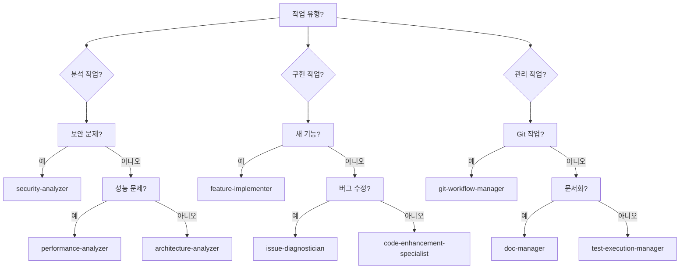

# 에이전트 오케스트레이션 모범 사례

## 복잡한 개발 작업을 위한 AI 에이전트 조정 마스터하기

여러 AI 에이전트를 효과적으로 조정하여 정교한 개발 워크플로우를 수행하고, 성능을 최적화하며, 코드 품질을 유지하는 방법을 배웁니다.

## 목차

1. [에이전트 오케스트레이션 이해](#에이전트-오케스트레이션-이해)
2. [에이전트 기능 매트릭스](#에이전트-기능-매트릭스)
3. [단일 에이전트 워크플로우](#단일-에이전트-워크플로우)
4. [다중 에이전트 오케스트레이션](#다중-에이전트-오케스트레이션)
5. [고급 오케스트레이션 패턴](#고급-오케스트레이션-패턴)
6. [성능 최적화](#성능-최적화)
7. [실제 사례](#실제-사례)
8. [문제 해결 및 디버깅](#문제-해결-및-디버깅)

## 에이전트 오케스트레이션 이해

### 에이전트 오케스트레이션이란?
에이전트 오케스트레이션은 여러 전문 AI 에이전트를 조정하여 복잡한 작업을 함께 수행하도록 하는 기술로, 각 에이전트의 강점을 활용하면서 의존성과 핸드오프를 관리합니다.

### 왜 에이전트를 오케스트레이션하는가?
- **전문화**: 각 에이전트는 특정 작업에서 뛰어남
- **병렬화**: 여러 에이전트가 동시에 작업 가능
- **품질**: 전문 에이전트가 더 나은 결과 생성
- **효율성**: 적절한 작업에 적절한 에이전트 사용
- **확장성**: 에이전트 간 작업 분산

### 26개 에이전트 개요
```
분석 (6개):        architecture, security, performance, code-quality, 
                  project-context, claude-structure
구현 (8개):        feature-implementer, code-enhancement, build-packager,
                  code-cleanup, task-orchestrator, workflow-orchestrator,
                  prd-workflow-generator, sdlc-coordinator
관리 (7개):        git-workflow, doc-manager, project-knowledge,
                  test-execution, dev-estimator, issue-diagnostician,
                  concept-explainer
지원 (5개):        agent-prompt-reviewer, focused-doc-generator,
                  기타 전문 헬퍼
```

## 에이전트 기능 매트릭스

### 에이전트 유형별 핵심 기능

| 에이전트 카테고리 | 읽기 | 쓰기 | 실행 | 분석 | 생성 | 오케스트레이션 |
|-----------------|------|------|------|------|------|---------------|
| 분석 | ✅ | ❌ | ✅ | ✅ | ✅ | ❌ |
| 구현 | ✅ | ✅ | ✅ | ✅ | ✅ | ✅ |
| 관리 | ✅ | ✅ | ✅ | ✅ | ✅ | ✅ |
| 지원 | ✅ | ✅ | ✅ | ✅ | ✅ | ❌ |

### 에이전트 선택 가이드



## 단일 에이전트 워크플로우

### 예제 1: 기능 구현
집중된 작업에 단일 에이전트 사용:

```bash
# 새 기능에 feature-implementer 사용
/orchestrate feature-implementation "user-profile-page"
```

`feature-implementer` 에이전트가 수행하는 작업:
1. 요구사항 분석
2. 컴포넌트 구조 설계
3. 기능 구현
4. 기본 테스트 추가
5. 문서 생성

#### 에이전트 구성
```json
{
  "agent": "feature-implementer",
  "task": "user-profile-page",
  "config": {
    "framework": "react",
    "styling": "tailwind",
    "testing": true,
    "documentation": true
  }
}
```

### 예제 2: 보안 분석
```bash
# security-analyzer로 심층 보안 스캔
/orchestrate security-audit "src/"
```

`security-analyzer`가 수행하는 작업:
```
보안 감사 결과
==================
발견된 취약점: 3

높음: SQL 인젝션 위험
파일: src/api/users.js:45
문제: 매개변수화되지 않은 쿼리
해결: 준비된 문 사용

중간: 약한 비밀번호 해싱
파일: src/auth/password.js:12
문제: MD5 해싱 감지됨
해결: salt rounds >= 10인 bcrypt 사용

낮음: CORS 헤더 누락
파일: src/server.js:23
문제: CORS 미구성
해결: 적절한 CORS 미들웨어 추가
```

### 예제 3: 성능 최적화
```bash
# 성능 분석 및 최적화
/orchestrate performance-tune "api/handlers"
```

에이전트 워크플로우:
1. **기준 성능 측정**
2. **프로파일링으로 병목 현상 식별**
3. **예제와 함께 최적화 제안**
4. **승인 시 변경 구현**
5. **벤치마크로 개선 사항 확인**

## 다중 에이전트 오케스트레이션

### 패턴 1: 순차 파이프라인
에이전트가 순차적으로 작업하며, 각각 이전 작업을 기반으로 구축:

```javascript
// 오케스트레이션 구성
{
  "workflow": "code-quality-pipeline",
  "agents": [
    {
      "name": "code-quality-analyzer",
      "task": "코드 품질 분석",
      "output": "quality-report.json"
    },
    {
      "name": "code-enhancement-specialist",
      "task": "품질 문제 수정",
      "input": "quality-report.json",
      "output": "enhanced-code"
    },
    {
      "name": "test-execution-manager",
      "task": "변경 검증",
      "input": "enhanced-code"
    }
  ]
}
```

### 패턴 2: 병렬 실행
여러 에이전트가 독립적인 작업을 동시에 수행:

```bash
# 병렬 에이전트 실행
/orchestrate parallel-analysis "project" \
  --agents="security-analyzer,performance-analyzer,architecture-analyzer"
```

실행 타임라인:
```
시간    에이전트 1 (보안)    에이전트 2 (성능)    에이전트 3 (아키텍처)
0:00    스캔 시작           프로파일링 시작       분석 시작
0:30    취약점 찾기         메트릭 측정          의존성 매핑
1:00    보고서 생성         병목 현상 식별        다이어그램 생성
1:30    완료 ✅             완료 ✅              완료 ✅
```

### 패턴 3: 계층적 오케스트레이션
마스터 에이전트가 하위 에이전트 조정:

```javascript
// 마스터 오케스트레이터 구성
{
  "master": "workflow-orchestrator",
  "task": "인증 구현",
  "subtasks": [
    {
      "agent": "system-architect",
      "phase": "설계",
      "deliverable": "auth-architecture.md"
    },
    {
      "agent": "feature-implementer",
      "phase": "구현",
      "dependencies": ["auth-architecture.md"],
      "deliverable": "auth-service"
    },
    {
      "agent": "test-execution-manager",
      "phase": "테스트",
      "dependencies": ["auth-service"],
      "deliverable": "test-results"
    }
  ]
}
```

### 패턴 4: 조건부 오케스트레이션
조건에 따라 에이전트 트리거:

```yaml
workflow: adaptive-development
steps:
  - agent: project-context-analyzer
    analyze: project
    
  - condition: "if project.type == 'api'"
    agent: api-specialist
    task: design-endpoints
    
  - condition: "if project.type == 'frontend'"
    agent: ui-component-designer
    task: create-components
    
  - condition: "if complexity > high"
    agents: 
      - architecture-analyzer
      - performance-analyzer
    parallel: true
```

## 고급 오케스트레이션 패턴

### 패턴 1: 피드백 루프
피드백에 따라 에이전트가 반복:

```python
# 피드백 루프 오케스트레이션
MAX_ITERATIONS = 3
quality_threshold = 90

for iteration in range(MAX_ITERATIONS):
    # 단계 1: 코드 생성
    code = feature_implementer.implement(requirements)
    
    # 단계 2: 품질 분석
    score = code_quality_analyzer.analyze(code)
    
    if score >= quality_threshold:
        break
        
    # 단계 3: 분석 기반 개선
    code = code_enhancement_specialist.enhance(
        code, 
        quality_report=score.report
    )
    
    # 단계 4: 재테스트
    test_execution_manager.test(code)
```

### 패턴 2: 합의 구축
여러 에이전트가 결정 검증:

```javascript
// 합의 오케스트레이션
const reviewers = [
  'security-analyzer',
  'performance-analyzer',
  'architecture-analyzer'
];

const reviews = await Promise.all(
  reviewers.map(agent => 
    orchestrate(agent, { task: 'review', code: implementation })
  )
);

const consensus = {
  approved: reviews.every(r => r.score >= 80),
  averageScore: reviews.reduce((sum, r) => sum + r.score, 0) / reviews.length,
  issues: reviews.flatMap(r => r.issues)
};

if (!consensus.approved) {
  await orchestrate('code-enhancement-specialist', {
    task: 'address-issues',
    issues: consensus.issues
  });
}
```

### 패턴 3: 폴백 전략
복원력을 위한 백업 에이전트:

```yaml
orchestration: resilient-implementation
primary_agent: feature-implementer
fallback_chain:
  - agent: code-enhancement-specialist
    trigger: "if primary.timeout"
  - agent: task-orchestrator
    trigger: "if primary.error"
  - agent: manual-intervention
    trigger: "if all.failed"
```

### 패턴 4: 학습 파이프라인
에이전트가 서로에게서 학습:

```javascript
// 학습 파이프라인
const pipeline = {
  stages: [
    {
      agent: 'issue-diagnostician',
      task: 'identify-patterns',
      output: 'common-issues.json'
    },
    {
      agent: 'project-knowledge-curator',
      task: 'document-patterns',
      input: 'common-issues.json',
      output: 'knowledge-base.md'
    },
    {
      agent: 'feature-implementer',
      task: 'apply-learned-patterns',
      knowledge: 'knowledge-base.md'
    }
  ]
};
```

## 성능 최적화

### 에이전트 선택 최적화

#### 전문 에이전트 선택
```bash
# ❌ 일반적 접근 (느림)
/orchestrate task-orchestrator "모든 것 구현"

# ✅ 전문화된 접근 (빠름)
/orchestrate feature-implementer "API 구현"
/orchestrate ui-component-designer "프론트엔드 구현"
/orchestrate test-execution-manager "모두 테스트"
```

#### 유사한 작업 배치
```javascript
// ❌ 여러 에이전트 호출
await analyze('file1.js');
await analyze('file2.js');
await analyze('file3.js');

// ✅ 배치 작업
await analyze(['file1.js', 'file2.js', 'file3.js']);
```

### 병렬 처리

#### 병렬 실행 구성
```json
{
  "orchestration": {
    "parallel": true,
    "maxConcurrency": 3,
    "tasks": [
      { "agent": "security-analyzer", "path": "src/" },
      { "agent": "performance-analyzer", "path": "api/" },
      { "agent": "test-execution-manager", "suite": "all" }
    ]
  }
}
```

#### 성능 비교
```
순차 실행: 
  총 시간: 45분
  CPU 사용량: 25%
  
병렬 실행:
  총 시간: 15분
  CPU 사용량: 75%
  
개선: 66% 빠름
```

### 리소스 관리

#### 에이전트 리소스 제한
```yaml
agents:
  feature-implementer:
    memory_limit: 512MB
    timeout: 300s
    retry_count: 2
    
  architecture-analyzer:
    memory_limit: 256MB
    timeout: 120s
    cache_results: true
```

#### 캐싱 전략
```javascript
const cachedAnalysis = cache.get('architecture-analysis');
if (cachedAnalysis && !isStale(cachedAnalysis)) {
  return cachedAnalysis;
}

const analysis = await orchestrate('architecture-analyzer');
cache.set('architecture-analysis', analysis, ttl=3600);
return analysis;
```

## 실제 사례

### 예제 1: 풀스택 기능 개발

**시나리오**: 완전한 사용자 대시보드 기능 구현

```bash
# 단계 1: 요구사항 분석
/orchestrate dev-estimator "dashboard-feature" --estimate

# 단계 2: 아키텍처 설계
/orchestrate system-architect "dashboard" --design

# 단계 3: 병렬 구현
/orchestrate parallel-implement \
  --frontend="ui-component-designer" \
  --backend="feature-implementer" \
  --database="data-model-designer"

# 단계 4: 통합
/orchestrate integration-specialist "combine-components"

# 단계 5: 테스팅
/orchestrate test-execution-manager "dashboard" --comprehensive

# 단계 6: 문서화
/orchestrate focused-doc-generator "dashboard" --user-guide
```

**오케스트레이션 타임라인**:
```
1일차: 요구사항 및 설계
  09:00 - dev-estimator: 2시간
  11:00 - system-architect: 3시간
  
2-3일차: 병렬 구현
  프론트엔드: 8시간
  백엔드: 10시간
  데이터베이스: 4시간
  
4일차: 통합 및 테스팅
  09:00 - 통합: 3시간
  12:00 - 테스팅: 4시간
  
5일차: 문서화 및 리뷰
  09:00 - 문서화: 2시간
  11:00 - 최종 리뷰: 1시간
```

### 예제 2: 레거시 코드 현대화

**시나리오**: 레거시 Node.js 애플리케이션 현대화

```javascript
// 오케스트레이션 워크플로우
const modernizationWorkflow = {
  phases: [
    {
      name: "분석",
      agents: [
        { agent: "project-context-analyzer", task: "레거시 이해" },
        { agent: "architecture-analyzer", task: "의존성 매핑" },
        { agent: "code-quality-analyzer", task: "문제 식별" }
      ],
      parallel: true
    },
    {
      name: "계획",
      agents: [
        { agent: "system-architect", task: "대상 아키텍처 설계" },
        { agent: "dev-estimator", task: "노력 추정" }
      ]
    },
    {
      name: "리팩토링",
      agents: [
        { agent: "code-cleanup-optimizer", task: "죽은 코드 제거" },
        { agent: "code-enhancement-specialist", task: "구문 현대화" },
        { agent: "performance-analyzer", task: "병목 현상 최적화" }
      ],
      sequential: true
    },
    {
      name: "검증",
      agents: [
        { agent: "test-execution-manager", task: "회귀 테스팅" },
        { agent: "security-analyzer", task: "보안 감사" }
      ]
    }
  ]
};
```

### 예제 3: 긴급 프로덕션 수정

**시나리오**: 프로덕션의 중요 버그 즉시 수정 필요

```bash
# 신속 대응 오케스트레이션
/orchestrate emergency-response "payment-processing-down" \
  --priority=critical \
  --agents="issue-diagnostician,feature-implementer,test-execution-manager" \
  --mode=expedited
```

**실행 플로우**:
```
T+0:00  알림 수신
T+0:01  issue-diagnostician: 근본 원인 분석 시작
T+0:15  issue-diagnostician: 결제 검증기에서 버그 식별
T+0:16  feature-implementer: 수정 구현 시작
T+0:45  feature-implementer: 수정 구현 완료
T+0:46  test-execution-manager: 긴급 테스팅 시작
T+1:00  test-execution-manager: 테스트 통과
T+1:01  git-workflow-manager: 핫픽스 PR 생성
T+1:15  배포 완료
```

## 문제 해결 및 디버깅

### 일반적인 오케스트레이션 문제

#### 문제 1: 에이전트 시간 초과
```bash
오류: 'feature-implementer' 에이전트가 300초 후 시간 초과됨
```

**해결책**:
```bash
# 복잡한 작업에 대한 시간 초과 증가
/orchestrate feature-implementer "complex-feature" \
  --timeout=600s \
  --chunk-size=small
```

#### 문제 2: 에이전트 출력 충돌
```bash
오류: 에이전트 출력 간 병합 충돌
```

**해결책**:
```javascript
// 병합 전략 구성
{
  "orchestration": {
    "merge_strategy": "last-write-wins",
    "conflict_resolution": "manual",
    "preserve_history": true
  }
}
```

#### 문제 3: 리소스 고갈
```bash
오류: 최대 동시 에이전트 수 초과
```

**해결책**:
```yaml
# 리소스 제한 구성
orchestration:
  max_concurrent_agents: 3
  queue_strategy: priority
  resource_monitor: enabled
  auto_scale: true
```

### 디버그 모드

상세 로깅 활성화:
```bash
# 오케스트레이션 디버깅 활성화
ORCHESTRATION_DEBUG=true \
AGENT_TRACE=true \
/orchestrate workflow-orchestrator "debug-task"
```

디버그 출력:
```
[DEBUG] 오케스트레이션 시작: debug-task
[TRACE] 에이전트: workflow-orchestrator 초기화됨
[DEBUG] 하위 작업 로딩 중...
[TRACE] 하위 작업 1: feature-implementer (대기 중)
[TRACE] 하위 작업 2: test-execution-manager (대기 중)
[DEBUG] 하위 작업 1 실행 중...
[TRACE] feature-implementer: 요구사항 분석 중
[TRACE] feature-implementer: 코드 생성 중
[DEBUG] 하위 작업 1 완료 (소요 시간: 45초)
```

### 모니터링 대시보드

```bash
# 오케스트레이션 모니터 시작
/orchestrate monitor --dashboard
```

대시보드 뷰:
```
┌─────────────────────────────────────────┐
│       오케스트레이션 대시보드            │
├─────────────────────────────────────────┤
│ 활성 에이전트: 3/5                      │
│ 대기열 길이: 7개 작업                   │
│ 평균 응답: 2.3초                        │
│                                         │
│ 에이전트 상태:                          │
│ ├─ feature-implementer     [████░░] 70%│
│ ├─ test-execution-manager  [██████] 100%│
│ └─ doc-generator          [██░░░░] 30%│
│                                         │
│ 최근 완료:                              │
│ ✅ security-analyzer (1분 전)          │
│ ✅ code-quality-analyzer (3분 전)      │
└─────────────────────────────────────────┘
```

## 모범 사례 요약

### 1. 에이전트 선택
- 특정 작업에 전문 에이전트 사용
- 에이전트 강점과 제한 사항 고려
- 전문화와 오버헤드 간 균형

### 2. 오케스트레이션 패턴
- 단순하게 시작하여 필요에 따라 복잡성 추가
- 독립적인 작업에 병렬 실행 사용
- 중요 경로에 폴백 전략 구현

### 3. 성능
- 유사한 작업 배치
- 적절한 경우 에이전트 출력 캐싱
- 리소스 사용량 모니터링

### 4. 오류 처리
- 백오프로 재시도 로직 구현
- 복원력을 위한 폴백 에이전트 사용
- 디버깅을 위한 포괄적인 로깅

### 5. 모니터링
- 에이전트 성능 메트릭 추적
- 실패에 대한 알림 설정
- 오케스트레이션 패턴 정기 검토

## 다음 단계

1. 단일 에이전트 워크플로우 연습
2. 병렬 오케스트레이션 실험
3. 사용자 정의 오케스트레이션 패턴 구축
4. CI/CD 파이프라인과 통합
5. 고급 에이전트 구성 탐색

## 리소스

- [AI 에이전트 API 참조](../api/agents.ko.md)
- [워크플로우 API 참조](../api/workflows.ko.md)
- [오케스트레이션 명령](../api/commands.ko.md#orchestration)
- [에이전트 구성 가이드](../../packages/@claude-code/agents/README.md)
