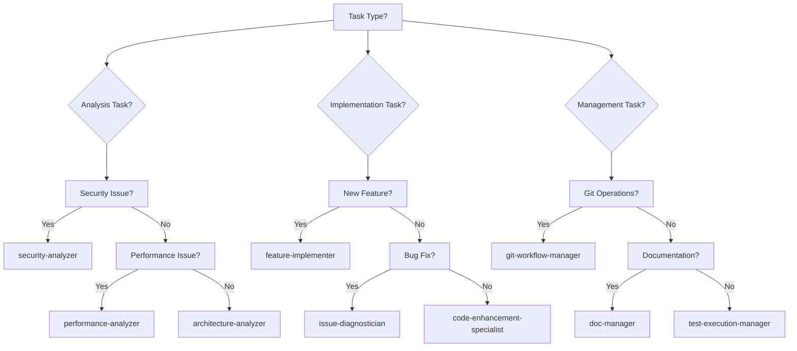

# Agent Orchestration Best Practices

## Mastering AI Agent Coordination for Complex Development Tasks

Learn how to effectively orchestrate multiple AI agents to accomplish sophisticated development workflows, optimize performance, and maintain code quality.

## Table of Contents

1. [Understanding Agent Orchestration](#understanding-agent-orchestration)
2. [Agent Capabilities Matrix](#agent-capabilities-matrix)
3. [Single Agent Workflows](#single-agent-workflows)
4. [Multi-Agent Orchestration](#multi-agent-orchestration)
5. [Advanced Orchestration Patterns](#advanced-orchestration-patterns)
6. [Performance Optimization](#performance-optimization)
7. [Real-World Examples](#real-world-examples)
8. [Troubleshooting & Debugging](#troubleshooting--debugging)

## Understanding Agent Orchestration

### What is Agent Orchestration?
Agent orchestration is the art of coordinating multiple specialized AI agents to work together on complex tasks, leveraging each agent's strengths while managing dependencies and handoffs.

### Why Orchestrate Agents?
- **Specialization**: Each agent excels at specific tasks
- **Parallelization**: Multiple agents can work simultaneously
- **Quality**: Specialized agents produce better results
- **Efficiency**: Right agent for the right job
- **Scalability**: Distribute work across agents

### The 26 Agents Overview
```
Analysis (6):        architecture, security, performance, code-quality, 
                    project-context, claude-structure
Implementation (8):  feature-implementer, code-enhancement, build-packager,
                    code-cleanup, task-orchestrator, workflow-orchestrator,
                    prd-workflow-generator, sdlc-coordinator
Management (7):      git-workflow, doc-manager, project-knowledge,
                    test-execution, dev-estimator, issue-diagnostician,
                    concept-explainer
Support (5):        agent-prompt-reviewer, focused-doc-generator,
                    and more specialized helpers
```

## Agent Capabilities Matrix

### Core Capabilities by Agent Type

| Agent Category | Read | Write | Execute | Analyze | Generate | Orchestrate |
|---------------|------|-------|---------|---------|----------|-------------|
| Analysis | ✅ | ❌ | ✅ | ✅ | ✅ | ❌ |
| Implementation | ✅ | ✅ | ✅ | ✅ | ✅ | ✅ |
| Management | ✅ | ✅ | ✅ | ✅ | ✅ | ✅ |
| Support | ✅ | ✅ | ✅ | ✅ | ✅ | ❌ |

### Agent Selection Guide



## Single Agent Workflows

### Example 1: Feature Implementation
Using a single agent for focused tasks:

```bash
# Use feature-implementer for new functionality
/orchestrate feature-implementation "user-profile-page"
```

The `feature-implementer` agent will:
1. Analyze requirements
2. Design component structure
3. Implement functionality
4. Add basic tests
5. Create documentation

#### Agent Configuration
```json
{
  "agent": "feature-implementer",
  "task": "user-profile-page",
  "config": {
    "framework": "react",
    "styling": "tailwind",
    "testing": true,
    "documentation": true
  }
}
```

### Example 2: Security Analysis
```bash
# Deep security scan with security-analyzer
/orchestrate security-audit "src/"
```

The `security-analyzer` performs:
```
Security Audit Results
======================
Vulnerabilities Found: 3

HIGH: SQL Injection Risk
File: src/api/users.js:45
Issue: Unparametrized query
Fix: Use prepared statements

MEDIUM: Weak Password Hashing
File: src/auth/password.js:12
Issue: MD5 hashing detected
Fix: Use bcrypt with salt rounds >= 10

LOW: Missing CORS Headers
File: src/server.js:23
Issue: CORS not configured
Fix: Add appropriate CORS middleware
```

### Example 3: Performance Optimization
```bash
# Performance analysis and optimization
/orchestrate performance-tune "api/handlers"
```

Agent workflow:
1. **Measure baseline** performance
2. **Identify bottlenecks** using profiling
3. **Suggest optimizations** with examples
4. **Implement changes** if approved
5. **Verify improvements** with benchmarks

## Multi-Agent Orchestration

### Pattern 1: Sequential Pipeline
Agents work in sequence, each building on previous work:

```javascript
// Orchestration configuration
{
  "workflow": "code-quality-pipeline",
  "agents": [
    {
      "name": "code-quality-analyzer",
      "task": "analyze code quality",
      "output": "quality-report.json"
    },
    {
      "name": "code-enhancement-specialist",
      "task": "fix quality issues",
      "input": "quality-report.json",
      "output": "enhanced-code"
    },
    {
      "name": "test-execution-manager",
      "task": "validate changes",
      "input": "enhanced-code"
    }
  ]
}
```

### Pattern 2: Parallel Execution
Multiple agents work simultaneously on independent tasks:

```bash
# Parallel agent execution
/orchestrate parallel-analysis "project" \
  --agents="security-analyzer,performance-analyzer,architecture-analyzer"
```

Execution timeline:
```
Time    Agent 1 (Security)    Agent 2 (Performance)    Agent 3 (Architecture)
0:00    Start scanning        Start profiling          Start analyzing
0:30    Finding vulns         Measuring metrics        Mapping dependencies
1:00    Generating report     Identifying bottlenecks  Creating diagrams
1:30    Complete ✅           Complete ✅              Complete ✅
```

### Pattern 3: Hierarchical Orchestration
Master agent coordinates sub-agents:

```javascript
// Master orchestrator configuration
{
  "master": "workflow-orchestrator",
  "task": "implement-authentication",
  "subtasks": [
    {
      "agent": "system-architect",
      "phase": "design",
      "deliverable": "auth-architecture.md"
    },
    {
      "agent": "feature-implementer",
      "phase": "implement",
      "dependencies": ["auth-architecture.md"],
      "deliverable": "auth-service"
    },
    {
      "agent": "test-execution-manager",
      "phase": "test",
      "dependencies": ["auth-service"],
      "deliverable": "test-results"
    }
  ]
}
```

### Pattern 4: Conditional Orchestration
Agents triggered based on conditions:

```yaml
workflow: adaptive-development
steps:
  - agent: project-context-analyzer
    analyze: project
    
  - condition: "if project.type == 'api'"
    agent: api-specialist
    task: design-endpoints
    
  - condition: "if project.type == 'frontend'"
    agent: ui-component-designer
    task: create-components
    
  - condition: "if complexity > high"
    agents: 
      - architecture-analyzer
      - performance-analyzer
    parallel: true
```

## Advanced Orchestration Patterns

### Pattern 1: Feedback Loop
Agents iterate based on feedback:

```python
# Feedback loop orchestration
MAX_ITERATIONS = 3
quality_threshold = 90

for iteration in range(MAX_ITERATIONS):
    # Step 1: Generate code
    code = feature_implementer.implement(requirements)
    
    # Step 2: Analyze quality
    score = code_quality_analyzer.analyze(code)
    
    if score >= quality_threshold:
        break
        
    # Step 3: Enhance based on analysis
    code = code_enhancement_specialist.enhance(
        code, 
        quality_report=score.report
    )
    
    # Step 4: Re-test
    test_execution_manager.test(code)
```

### Pattern 2: Consensus Building
Multiple agents validate decisions:

```javascript
// Consensus orchestration
const reviewers = [
  'security-analyzer',
  'performance-analyzer',
  'architecture-analyzer'
];

const reviews = await Promise.all(
  reviewers.map(agent => 
    orchestrate(agent, { task: 'review', code: implementation })
  )
);

const consensus = {
  approved: reviews.every(r => r.score >= 80),
  averageScore: reviews.reduce((sum, r) => sum + r.score, 0) / reviews.length,
  issues: reviews.flatMap(r => r.issues)
};

if (!consensus.approved) {
  await orchestrate('code-enhancement-specialist', {
    task: 'address-issues',
    issues: consensus.issues
  });
}
```

### Pattern 3: Fallback Strategy
Backup agents for resilience:

```yaml
orchestration: resilient-implementation
primary_agent: feature-implementer
fallback_chain:
  - agent: code-enhancement-specialist
    trigger: "if primary.timeout"
  - agent: task-orchestrator
    trigger: "if primary.error"
  - agent: manual-intervention
    trigger: "if all.failed"
```

### Pattern 4: Learning Pipeline
Agents learn from each other:

```javascript
// Learning pipeline
const pipeline = {
  stages: [
    {
      agent: 'issue-diagnostician',
      task: 'identify-patterns',
      output: 'common-issues.json'
    },
    {
      agent: 'project-knowledge-curator',
      task: 'document-patterns',
      input: 'common-issues.json',
      output: 'knowledge-base.md'
    },
    {
      agent: 'feature-implementer',
      task: 'apply-learned-patterns',
      knowledge: 'knowledge-base.md'
    }
  ]
};
```

## Performance Optimization

### Agent Selection Optimization

#### Choose Specialized Agents
```bash
# ❌ Generic approach (slower)
/orchestrate task-orchestrator "implement everything"

# ✅ Specialized approach (faster)
/orchestrate feature-implementer "implement api"
/orchestrate ui-component-designer "implement frontend"
/orchestrate test-execution-manager "test all"
```

#### Batch Similar Operations
```javascript
// ❌ Multiple agent invocations
await analyze('file1.js');
await analyze('file2.js');
await analyze('file3.js');

// ✅ Batched operation
await analyze(['file1.js', 'file2.js', 'file3.js']);
```

### Parallel Processing

#### Configure Parallel Execution
```json
{
  "orchestration": {
    "parallel": true,
    "maxConcurrency": 3,
    "tasks": [
      { "agent": "security-analyzer", "path": "src/" },
      { "agent": "performance-analyzer", "path": "api/" },
      { "agent": "test-execution-manager", "suite": "all" }
    ]
  }
}
```

#### Performance Comparison
```
Sequential Execution: 
  Total Time: 45 minutes
  CPU Usage: 25%
  
Parallel Execution:
  Total Time: 15 minutes
  CPU Usage: 75%
  
Improvement: 66% faster
```

### Resource Management

#### Agent Resource Limits
```yaml
agents:
  feature-implementer:
    memory_limit: 512MB
    timeout: 300s
    retry_count: 2
    
  architecture-analyzer:
    memory_limit: 256MB
    timeout: 120s
    cache_results: true
```

#### Caching Strategy
```javascript
const cachedAnalysis = cache.get('architecture-analysis');
if (cachedAnalysis && !isStale(cachedAnalysis)) {
  return cachedAnalysis;
}

const analysis = await orchestrate('architecture-analyzer');
cache.set('architecture-analysis', analysis, ttl=3600);
return analysis;
```

## Real-World Examples

### Example 1: Full-Stack Feature Development

**Scenario**: Implement a complete user dashboard feature

```bash
# Step 1: Requirements analysis
/orchestrate dev-estimator "dashboard-feature" --estimate

# Step 2: Architecture design
/orchestrate system-architect "dashboard" --design

# Step 3: Parallel implementation
/orchestrate parallel-implement \
  --frontend="ui-component-designer" \
  --backend="feature-implementer" \
  --database="data-model-designer"

# Step 4: Integration
/orchestrate integration-specialist "combine-components"

# Step 5: Testing
/orchestrate test-execution-manager "dashboard" --comprehensive

# Step 6: Documentation
/orchestrate focused-doc-generator "dashboard" --user-guide
```

**Orchestration Timeline**:
```
Day 1: Requirements & Design
  09:00 - dev-estimator: 2 hours
  11:00 - system-architect: 3 hours
  
Day 2-3: Parallel Implementation
  Frontend: 8 hours
  Backend: 10 hours
  Database: 4 hours
  
Day 4: Integration & Testing
  09:00 - integration: 3 hours
  12:00 - testing: 4 hours
  
Day 5: Documentation & Review
  09:00 - documentation: 2 hours
  11:00 - final review: 1 hour
```

### Example 2: Legacy Code Modernization

**Scenario**: Modernize a legacy Node.js application

```javascript
// Orchestration workflow
const modernizationWorkflow = {
  phases: [
    {
      name: "Analysis",
      agents: [
        { agent: "project-context-analyzer", task: "understand-legacy" },
        { agent: "architecture-analyzer", task: "map-dependencies" },
        { agent: "code-quality-analyzer", task: "identify-issues" }
      ],
      parallel: true
    },
    {
      name: "Planning",
      agents: [
        { agent: "system-architect", task: "design-target-architecture" },
        { agent: "dev-estimator", task: "estimate-effort" }
      ]
    },
    {
      name: "Refactoring",
      agents: [
        { agent: "code-cleanup-optimizer", task: "remove-dead-code" },
        { agent: "code-enhancement-specialist", task: "modernize-syntax" },
        { agent: "performance-analyzer", task: "optimize-bottlenecks" }
      ],
      sequential: true
    },
    {
      name: "Validation",
      agents: [
        { agent: "test-execution-manager", task: "regression-testing" },
        { agent: "security-analyzer", task: "security-audit" }
      ]
    }
  ]
};
```

### Example 3: Emergency Production Fix

**Scenario**: Critical bug in production needs immediate fix

```bash
# Rapid response orchestration
/orchestrate emergency-response "payment-processing-down" \
  --priority=critical \
  --agents="issue-diagnostician,feature-implementer,test-execution-manager" \
  --mode=expedited
```

**Execution Flow**:
```
T+0:00  Alert received
T+0:01  issue-diagnostician: Start root cause analysis
T+0:15  issue-diagnostician: Bug identified in payment validator
T+0:16  feature-implementer: Start implementing fix
T+0:45  feature-implementer: Fix implemented
T+0:46  test-execution-manager: Start emergency testing
T+1:00  test-execution-manager: Tests passed
T+1:01  git-workflow-manager: Create hotfix PR
T+1:15  Deployment complete
```

## Troubleshooting & Debugging

### Common Orchestration Issues

#### Issue 1: Agent Timeout
```bash
Error: Agent 'feature-implementer' timed out after 300s
```

**Solution**:
```bash
# Increase timeout for complex tasks
/orchestrate feature-implementer "complex-feature" \
  --timeout=600s \
  --chunk-size=small
```

#### Issue 2: Conflicting Agent Outputs
```bash
Error: Merge conflict between agent outputs
```

**Solution**:
```javascript
// Configure merge strategy
{
  "orchestration": {
    "merge_strategy": "last-write-wins",
    "conflict_resolution": "manual",
    "preserve_history": true
  }
}
```

#### Issue 3: Resource Exhaustion
```bash
Error: Maximum concurrent agents exceeded
```

**Solution**:
```yaml
# Configure resource limits
orchestration:
  max_concurrent_agents: 3
  queue_strategy: priority
  resource_monitor: enabled
  auto_scale: true
```

### Debug Mode

Enable detailed logging:
```bash
# Enable orchestration debugging
ORCHESTRATION_DEBUG=true \
AGENT_TRACE=true \
/orchestrate workflow-orchestrator "debug-task"
```

Debug output:
```
[DEBUG] Starting orchestration: debug-task
[TRACE] Agent: workflow-orchestrator initialized
[DEBUG] Loading subtasks...
[TRACE] Subtask 1: feature-implementer (pending)
[TRACE] Subtask 2: test-execution-manager (waiting)
[DEBUG] Executing subtask 1...
[TRACE] feature-implementer: Analyzing requirements
[TRACE] feature-implementer: Generating code
[DEBUG] Subtask 1 complete (duration: 45s)
```

### Monitoring Dashboard

```bash
# Start orchestration monitor
/orchestrate monitor --dashboard
```

Dashboard view:
```
┌─────────────────────────────────────────┐
│       Orchestration Dashboard           │
├─────────────────────────────────────────┤
│ Active Agents: 3/5                      │
│ Queue Length: 7 tasks                   │
│ Avg Response: 2.3s                      │
│                                         │
│ Agent Status:                           │
│ ├─ feature-implementer     [████░░] 70%│
│ ├─ test-execution-manager  [██████] 100%│
│ └─ doc-generator          [██░░░░] 30%│
│                                         │
│ Recent Completions:                     │
│ ✅ security-analyzer (1m ago)          │
│ ✅ code-quality-analyzer (3m ago)      │
└─────────────────────────────────────────┘
```

## Best Practices Summary

### 1. Agent Selection
- Use specialized agents for specific tasks
- Consider agent strengths and limitations
- Balance between specialization and overhead

### 2. Orchestration Patterns
- Start simple, add complexity as needed
- Use parallel execution for independent tasks
- Implement fallback strategies for critical paths

### 3. Performance
- Batch similar operations
- Cache agent outputs when appropriate
- Monitor resource usage

### 4. Error Handling
- Implement retry logic with backoff
- Use fallback agents for resilience
- Log comprehensively for debugging

### 5. Monitoring
- Track agent performance metrics
- Set up alerts for failures
- Review orchestration patterns regularly

## Next Steps

1. Practice with single-agent workflows
2. Experiment with parallel orchestration
3. Build custom orchestration patterns
4. Integrate with CI/CD pipelines
5. Explore advanced agent configurations

## Resources

- [AI Agents API Reference](../api/agents.md)
- [Workflow API Reference](../api/workflows.md)
- [Orchestration Commands](../api/commands.md#orchestration)
- [Agent Configuration Guide](../../packages/@claude-code/agents/README.md)
