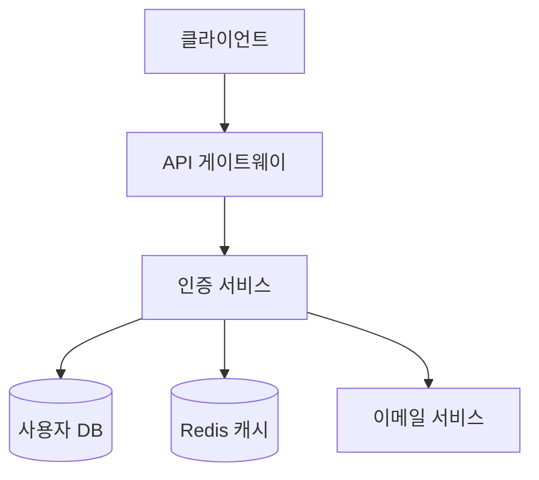
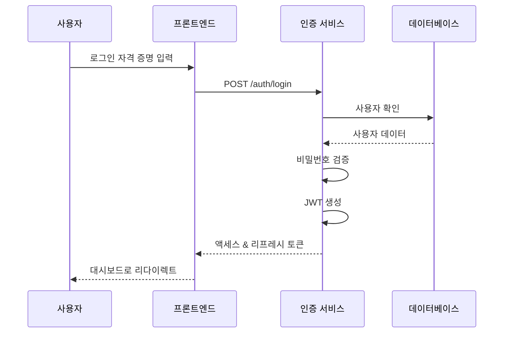

# PRD 개발 튜토리얼

## 효과적인 제품 요구사항 문서 작성 마스터하기

체계적이고 실행 가능한 제품 요구사항 문서(PRD)를 작성하여 SDLC 파이프라인과 원활하게 통합하는 방법을 배웁니다.

## 목차

1. [PRD 이해하기](#prd-이해하기)
2. [PRD 구조](#prd-구조)
3. [단계별 PRD 작성](#단계별-prd-작성)
4. [실제 예제: 사용자 인증 시스템](#실제-예제-사용자-인증-시스템)
5. [PRD 모범 사례](#prd-모범-사례)
6. [PRD 워크플로우 통합](#prd-워크플로우-통합)
7. [일반적인 실수 및 해결 방법](#일반적인-실수-및-해결-방법)
8. [고급 기법](#고급-기법)

## PRD 이해하기

### PRD란 무엇인가?
제품 요구사항 문서(PRD)는 구축할 제품이나 기능의 청사진입니다. 무엇을, 왜, 어떻게 구축할지를 정의하여 모든 이해관계자가 비전과 요구사항을 일치시킵니다.

### 왜 PRD가 중요한가?
- **명확성**: 모호함 제거
- **일치**: 팀 정렬 보장
- **추적성**: 진행 상황 추적 가능
- **자동화**: SDLC 파이프라인 통합 가능
- **문서화**: 결정과 요구사항 기록

### PRD 라이프사이클
```
작성 → 검토 → 승인 → 구현 → 검증 → 보관
```

## PRD 구조

### 표준 PRD 템플릿
```markdown
# PRD: [기능 이름]

## 1. 개요
### 1.1 목적
### 1.2 범위
### 1.3 목표

## 2. 요구사항
### 2.1 기능 요구사항
### 2.2 비기능 요구사항
### 2.3 기술 요구사항

## 3. 사용자 스토리
### 3.1 페르소나
### 3.2 사용 사례
### 3.3 사용자 여정

## 4. 기술 사양
### 4.1 아키텍처
### 4.2 데이터 모델
### 4.3 API 설계

## 5. 수용 기준
### 5.1 기능 테스트
### 5.2 성능 메트릭
### 5.3 보안 요구사항

## 6. 타임라인
### 6.1 마일스톤
### 6.2 의존성
### 6.3 리스크
```

## 단계별 PRD 작성

### 단계 1: PRD 초기화
```bash
# 새 PRD 생성
/manage:prd create "user-authentication" --template=standard
```

생성되는 파일:
```
docs/prd/draft/user-authentication.md
```

### 단계 2: 개요 섹션 정의
```markdown
## 1. 개요

### 1.1 목적
애플리케이션을 위한 안전하고 확장 가능한 사용자 인증 시스템을 구현하여 
사용자 등록, 로그인, 비밀번호 재설정 및 세션 관리를 지원합니다.

### 1.2 범위
- ✅ 포함: 사용자 등록, 로그인, JWT 토큰, 비밀번호 재설정
- ❌ 제외: 소셜 로그인, 생체 인증, 2FA (향후 단계)

### 1.3 목표
- 사용자 온보딩 시간 < 2분
- 99.9% 가동 시간
- OWASP Top 10 준수
```

### 단계 3: 요구사항 상세화
```markdown
## 2. 요구사항

### 2.1 기능 요구사항

#### FR-001: 사용자 등록
- 이메일/비밀번호로 등록
- 이메일 검증
- 비밀번호 강도 확인
- 중복 계정 방지

#### FR-002: 사용자 로그인
- 이메일/비밀번호 인증
- JWT 토큰 생성
- 기억하기 옵션
- 계정 잠금 (5회 실패 시도 후)

#### FR-003: 비밀번호 관리
- 비밀번호 재설정 이메일
- 비밀번호 변경
- 비밀번호 정책 시행
```

### 단계 4: 사용자 스토리 작성
```markdown
## 3. 사용자 스토리

### 3.1 페르소나
**신규 사용자 (Sarah)**
- 25세, 모바일 우선 사용자
- 빠르고 간단한 등록 원함
- 보안에 대한 우려 있음

### 3.2 사용 사례

#### UC-001: 첫 번째 사용자 등록
```gherkin
Given 방문자가 홈페이지에 있을 때
When "가입" 버튼을 클릭하면
Then 등록 양식이 표시되어야 함
When 유효한 이메일과 비밀번호를 입력하면
Then 확인 이메일이 전송되어야 함
```
```

### 단계 5: 기술 사양 정의
```markdown
## 4. 기술 사양

### 4.1 아키텍처


### 4.2 데이터 모델
```sql
CREATE TABLE users (
    id UUID PRIMARY KEY,
    email VARCHAR(255) UNIQUE NOT NULL,
    password_hash VARCHAR(255) NOT NULL,
    created_at TIMESTAMP DEFAULT NOW(),
    email_verified BOOLEAN DEFAULT FALSE,
    last_login TIMESTAMP
);
```

### 4.3 API 설계
```yaml
POST /api/auth/register
  Request:
    email: string
    password: string
  Response:
    user_id: uuid
    message: string

POST /api/auth/login
  Request:
    email: string
    password: string
  Response:
    access_token: string
    refresh_token: string
```
```

## 실제 예제: 사용자 인증 시스템

### 완전한 PRD 예제

```markdown
# PRD: 사용자 인증 시스템

## 1. 개요

### 1.1 목적
엔터프라이즈급 사용자 인증 시스템을 구현하여 안전한 사용자 관리, 
인증 및 권한 부여를 제공합니다.

### 1.2 범위
**포함 사항:**
- JWT 기반 인증
- 역할 기반 접근 제어 (RBAC)
- 비밀번호 정책 및 재설정
- 세션 관리
- 감사 로깅

**제외 사항:**
- OAuth2/소셜 로그인
- 다단계 인증 (MFA)
- 생체 인증

### 1.3 목표
- 보안: OWASP 인증 체크리스트 100% 준수
- 성능: 인증 응답 시간 < 200ms
- 확장성: 100만 동시 사용자 지원
- 신뢰성: 99.99% 가동 시간

## 2. 요구사항

### 2.1 기능 요구사항

#### FR-001: 사용자 등록
**설명:** 사용자가 새 계정을 생성할 수 있어야 함
**수용 기준:**
- ✅ 유효한 이메일 형식 검증
- ✅ 비밀번호 최소 8자, 대문자, 숫자, 특수문자 포함
- ✅ 이메일 확인 링크 전송
- ✅ 중복 이메일 방지
- ✅ 등록 시도 속도 제한

#### FR-002: 사용자 인증
**설명:** 사용자가 자격 증명으로 로그인할 수 있어야 함
**수용 기준:**
- ✅ 이메일/비밀번호 검증
- ✅ JWT 액세스 토큰 생성 (15분 만료)
- ✅ 리프레시 토큰 생성 (7일 만료)
- ✅ 5회 실패 시도 후 계정 잠금
- ✅ 로그인 이벤트 감사 로깅

#### FR-003: 세션 관리
**설명:** 사용자 세션을 안전하게 관리
**수용 기준:**
- ✅ 토큰 갱신 메커니즘
- ✅ 로그아웃 시 토큰 무효화
- ✅ 동시 세션 제한 (최대 3개 장치)
- ✅ 세션 타임아웃 (30분 비활동)

### 2.2 비기능 요구사항

#### NFR-001: 보안
- 모든 비밀번호 bcrypt로 해시 (salt rounds: 12)
- HTTPS 전용 통신
- SQL 인젝션 방지
- XSS 보호
- CSRF 토큰

#### NFR-002: 성능
- API 응답 시간 P95 < 200ms
- 초당 1000 인증 요청 처리
- Redis 캐싱으로 데이터베이스 부하 감소

#### NFR-003: 확장성
- 수평 확장 가능
- 무상태 아키텍처
- 로드 밸런서 지원

## 3. 사용자 스토리

### 3.1 신규 사용자 등록
```
As a 신규 방문자
I want to 계정을 생성
So that 애플리케이션 기능에 접근할 수 있음
```

**시나리오:**
1. 홈페이지 방문
2. "가입" 클릭
3. 이메일과 비밀번호 입력
4. 이용 약관 동의
5. "계정 생성" 클릭
6. 확인 이메일 수신
7. 이메일 링크 클릭
8. 계정 활성화 완료

### 3.2 기존 사용자 로그인
```
As a 등록된 사용자
I want to 내 계정에 로그인
So that 개인화된 콘텐츠에 접근할 수 있음
```

## 4. 기술 사양

### 4.1 시스템 아키텍처
```
┌─────────────┐     ┌─────────────┐     ┌─────────────┐
│   Frontend  │────▶│  API Gateway │────▶│ Auth Service│
└─────────────┘     └─────────────┘     └─────────────┘
                                                │
                    ┌─────────────┬─────────────┼─────────────┐
                    ▼             ▼             ▼             ▼
              ┌──────────┐ ┌──────────┐ ┌──────────┐ ┌──────────┐
              │PostgreSQL│ │  Redis   │ │  Email   │ │  Audit   │
              └──────────┘ └──────────┘ └──────────┘ └──────────┘
```

### 4.2 API 엔드포인트

| 메서드 | 엔드포인트 | 설명 | 인증 필요 |
|--------|-----------|------|-----------|
| POST | /auth/register | 새 사용자 등록 | ❌ |
| POST | /auth/login | 사용자 로그인 | ❌ |
| POST | /auth/logout | 사용자 로그아웃 | ✅ |
| POST | /auth/refresh | 토큰 갱신 | ✅ |
| POST | /auth/reset-password | 비밀번호 재설정 | ❌ |
| GET | /auth/verify-email | 이메일 확인 | ❌ |

### 4.3 데이터베이스 스키마
```sql
-- 사용자 테이블
CREATE TABLE users (
    id UUID PRIMARY KEY DEFAULT gen_random_uuid(),
    email VARCHAR(255) UNIQUE NOT NULL,
    password_hash VARCHAR(255) NOT NULL,
    email_verified BOOLEAN DEFAULT FALSE,
    created_at TIMESTAMP DEFAULT CURRENT_TIMESTAMP,
    updated_at TIMESTAMP DEFAULT CURRENT_TIMESTAMP,
    last_login TIMESTAMP,
    failed_attempts INT DEFAULT 0,
    locked_until TIMESTAMP
);

-- 세션 테이블
CREATE TABLE sessions (
    id UUID PRIMARY KEY DEFAULT gen_random_uuid(),
    user_id UUID REFERENCES users(id),
    refresh_token VARCHAR(500) UNIQUE NOT NULL,
    device_info JSONB,
    created_at TIMESTAMP DEFAULT CURRENT_TIMESTAMP,
    expires_at TIMESTAMP NOT NULL
);

-- 감사 로그 테이블
CREATE TABLE audit_logs (
    id UUID PRIMARY KEY DEFAULT gen_random_uuid(),
    user_id UUID REFERENCES users(id),
    action VARCHAR(50) NOT NULL,
    details JSONB,
    ip_address INET,
    user_agent TEXT,
    created_at TIMESTAMP DEFAULT CURRENT_TIMESTAMP
);
```

## 5. 수용 기준

### 5.1 기능 테스트
- [ ] 유효한 데이터로 사용자 등록 성공
- [ ] 잘못된 이메일 형식 거부
- [ ] 약한 비밀번호 거부
- [ ] 중복 이메일 등록 방지
- [ ] 이메일 확인 플로우 작동
- [ ] 로그인/로그아웃 플로우 작동
- [ ] 비밀번호 재설정 플로우 작동
- [ ] 토큰 갱신 메커니즘 작동

### 5.2 성능 메트릭
- [ ] 등록 API < 300ms
- [ ] 로그인 API < 200ms
- [ ] 토큰 검증 < 50ms
- [ ] 초당 1000 요청 처리

### 5.3 보안 검증
- [ ] OWASP Top 10 취약점 없음
- [ ] 침투 테스트 통과
- [ ] 보안 헤더 구현
- [ ] 속도 제한 작동

## 6. 타임라인

### 6.1 개발 단계
| 단계 | 기간 | 산출물 |
|------|------|--------|
| 설계 | 3일 | 아키텍처 문서, API 사양 |
| 백엔드 개발 | 5일 | 인증 서비스, 데이터베이스 |
| 프론트엔드 개발 | 4일 | 등록/로그인 UI |
| 통합 | 2일 | 전체 시스템 통합 |
| 테스팅 | 3일 | 단위/통합/E2E 테스트 |
| 배포 | 1일 | 프로덕션 배포 |

### 6.2 의존성
- 데이터베이스 설정 완료
- 이메일 서비스 구성
- Redis 캐시 설정
- SSL 인증서 준비

### 6.3 리스크
| 리스크 | 영향 | 완화 |
|--------|------|------|
| 이메일 전달 실패 | 높음 | 백업 이메일 제공자 |
| 데이터베이스 다운타임 | 높음 | 복제 및 페일오버 |
| DDoS 공격 | 중간 | 속도 제한 및 WAF |
```

## PRD 모범 사례

### 1. 명확하고 간결하게 작성
```markdown
❌ 나쁜 예:
"시스템은 사용자가 로그인할 수 있어야 한다"

✅ 좋은 예:
"사용자는 이메일과 비밀번호를 사용하여 로그인하고, 
성공 시 15분 만료의 JWT 액세스 토큰을 받아야 한다"
```

### 2. 측정 가능한 기준 사용
```markdown
❌ 나쁜 예:
"시스템은 빨라야 한다"

✅ 좋은 예:
"API 응답 시간은 P95에서 200ms 미만이어야 한다"
```

### 3. 우선순위 정의
```markdown
## 우선순위
P0 (필수): 기본 인증 플로우
P1 (중요): 비밀번호 재설정
P2 (좋음): 세션 관리
P3 (향후): 소셜 로그인
```

### 4. 시각적 다이어그램 포함


## PRD 워크플로우 통합

### PRD에서 구현까지
```bash
# 1. PRD 생성
/manage:prd create "feature-name" --template=standard

# 2. PRD 검토
/support:prd-review "feature-name"

# 3. PRD 승인
/manage:prd approve "feature-name"

# 4. SDLC 파이프라인 자동 트리거
# (승인 시 자동으로 시작됨)

# 5. 진행 상황 추적
/manage:prd status "feature-name"
```

### PRD 상태 관리
```
draft/ → review/ → approved/ → active/ → completed/
```

### PRD 기반 자동화
```yaml
# .claude/workflows/prd-automation.yaml
triggers:
  - event: prd_approved
    action: start_sdlc_pipeline
    
  - event: prd_updated
    action: notify_stakeholders
    
  - event: implementation_complete
    action: validate_against_prd
```

## 일반적인 실수 및 해결 방법

### 실수 1: 모호한 요구사항
**문제:**
```markdown
"시스템은 사용자 친화적이어야 한다"
```

**해결책:**
```markdown
"사용자는 3번 클릭 이내에 모든 주요 기능에 접근할 수 있어야 한다"
```

### 실수 2: 기술 의존성 누락
**문제:**
```markdown
요구사항: 실시간 알림
(WebSocket 인프라 언급 없음)
```

**해결책:**
```markdown
요구사항: 실시간 알림
의존성: 
- WebSocket 서버 (Socket.io)
- Redis Pub/Sub
- 로드 밸런서 스티키 세션
```

### 실수 3: 범위 크리프
**문제:**
```markdown
v1.0: 기본 인증
(나중에 추가: OAuth, MFA, 생체 인증...)
```

**해결책:**
```markdown
v1.0 범위 (고정):
- 기본 인증만

v2.0 백로그:
- OAuth 통합
- MFA 지원
```

## 고급 기법

### 1. 조건부 요구사항
```markdown
## 조건부 요구사항
IF user_count > 10000 THEN
  - 캐싱 레이어 구현
  - 데이터베이스 샤딩 활성화
  - CDN 통합
```

### 2. A/B 테스트 사양
```markdown
## A/B 테스트 요구사항
실험: 등록 플로우
- 변형 A: 단일 페이지 양식
- 변형 B: 다단계 마법사
- 메트릭: 완료율, 이탈률
- 샘플 크기: 각 1000명 사용자
```

### 3. 롤백 계획
```markdown
## 롤백 전략
트리거:
- 오류율 > 5%
- 응답 시간 > 1초
- 보안 침해 감지

절차:
1. 트래픽을 이전 버전으로 전환
2. 데이터베이스 마이그레이션 되돌리기
3. 캐시 지우기
4. 인시던트 사후 분석
```

### 4. 성공 메트릭
```markdown
## 성공 메트릭
30일 후:
- 일일 활성 사용자 > 1000
- 등록 전환율 > 25%
- 인증 성공률 > 95%
- 사용자 만족도 > 4.5/5
```

## 템플릿 및 리소스

### PRD 템플릿 유형
```bash
# 사용 가능한 템플릿
standard   - 일반 목적 PRD
api        - API 중심 기능
frontend   - UI/UX 중심 기능
fullstack  - 전체 스택 기능
mobile     - 모바일 앱 기능
```

### PRD 체크리스트
- [ ] 명확한 목적과 목표
- [ ] 측정 가능한 수용 기준
- [ ] 기술 사양
- [ ] 사용자 스토리
- [ ] 타임라인과 마일스톤
- [ ] 리스크와 완화
- [ ] 의존성 식별
- [ ] 성공 메트릭

## 다음 단계

1. **PRD 작성 연습**: 템플릿으로 시작
2. **피어 리뷰**: 동료 피드백 받기
3. **반복 개선**: 피드백 기반 수정
4. **SDLC 통합**: 파이프라인과 연결
5. **메트릭 추적**: 구현 후 검증

## 요약

효과적인 PRD는:
- **명확함**: 모호함 없음
- **완전함**: 모든 측면 포함
- **측정 가능**: 정량적 기준
- **추적 가능**: 진행 상황 모니터링 가능
- **실행 가능**: 즉시 구현 가능

잘 작성된 PRD는 성공적인 기능 구현의 기초이며, 팀 정렬과 효율적인 개발 프로세스를 보장합니다.