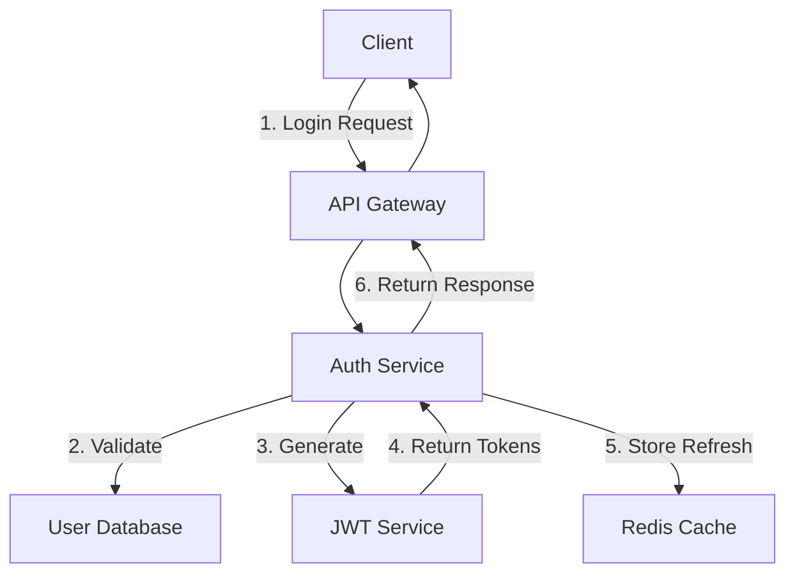

# PRD Development Tutorial

## Building Your First Product Requirements Document

This tutorial will guide you through creating a comprehensive PRD from scratch, getting it approved, and automatically starting development.

## Table of Contents

1. [Prerequisites](#prerequisites)
2. [Understanding PRDs](#understanding-prds)
3. [Creating Your First PRD](#creating-your-first-prd)
4. [Writing Effective Requirements](#writing-effective-requirements)
5. [PRD Review Process](#prd-review-process)
6. [From PRD to Code](#from-prd-to-code)
7. [Best Practices](#best-practices)
8. [Common Pitfalls](#common-pitfalls)

## Prerequisites

Before starting this tutorial, ensure you have:
- Claude Code Context Engineering Template installed
- Basic understanding of software requirements
- A feature idea to document

## Understanding PRDs

### What is a PRD?
A Product Requirements Document (PRD) is a comprehensive document that defines:
- **What** needs to be built
- **Why** it needs to be built
- **Success criteria** for the feature
- **Technical specifications** and constraints

### Why Use PRDs?
- **Clarity**: Everyone understands what's being built
- **Alignment**: Stakeholders agree before development
- **Efficiency**: Reduces rework and miscommunication
- **Documentation**: Creates historical record

## Creating Your First PRD

### Step 1: Choose Your Feature
For this tutorial, we'll build a "User Authentication System" with JWT tokens.

### Step 2: Initialize the PRD
```bash
/manage:prd create "user-authentication" --template=api
```

This creates: `docs/prd/draft/user-authentication.md`

### Step 3: Open the Generated Template
The template provides structure for your PRD:

```markdown
# PRD: User Authentication

## Executive Summary
[Brief overview of the feature]

## Problem Statement
[What problem are we solving?]

## Goals and Success Metrics
[How do we measure success?]

## Requirements
### Functional Requirements
[What the system must do]

### Non-Functional Requirements
[Performance, security, scalability]

## Technical Design
[Implementation approach]

## Timeline
[Development phases and milestones]
```

## Writing Effective Requirements

### Executive Summary Example
```markdown
## Executive Summary
**Feature**: JWT-based authentication system for REST API
**Priority**: P0 (Critical)
**Target Release**: v2.0.0
**Estimated Effort**: 2 weeks

This PRD defines a secure, scalable authentication system using JWT tokens
for our REST API, supporting user registration, login, logout, and
token refresh capabilities.
```

### Problem Statement Example
```markdown
## Problem Statement

Current State:
- No authentication mechanism exists
- API endpoints are publicly accessible
- User data cannot be protected
- No user session management

Impact:
- Security vulnerability: unauthorized access
- Cannot implement user-specific features
- Cannot track user activity
- Compliance issues with data protection

Proposed Solution:
Implement JWT-based authentication with secure token management,
providing stateless authentication that scales horizontally.
```

### Functional Requirements Example
```markdown
## Requirements

### Functional Requirements

#### FR1: User Registration
- System SHALL allow new users to register with email and password
- System SHALL validate email format and uniqueness
- System SHALL hash passwords using bcrypt (min 10 rounds)
- System SHALL send email verification link
- System SHALL create user profile upon verification

#### FR2: User Login
- System SHALL authenticate users with email/password
- System SHALL return JWT access token (15 min expiry)
- System SHALL return JWT refresh token (7 days expiry)
- System SHALL track failed login attempts
- System SHALL implement rate limiting (5 attempts/15 min)

#### FR3: Token Management
- System SHALL validate JWT tokens on protected routes
- System SHALL allow token refresh before expiry
- System SHALL revoke tokens on logout
- System SHALL maintain token blacklist
```

### Non-Functional Requirements Example
```markdown
### Non-Functional Requirements

#### Performance
- NFR1: Authentication response time < 200ms (95th percentile)
- NFR2: Support 1000 concurrent authentication requests
- NFR3: Token validation < 10ms

#### Security
- NFR4: Passwords hashed with bcrypt (minimum 10 rounds)
- NFR5: JWT tokens signed with RS256
- NFR6: Refresh tokens stored encrypted
- NFR7: HTTPS required for all endpoints

#### Scalability
- NFR8: Horizontally scalable (stateless design)
- NFR9: Support 100,000 active users
- NFR10: Redis cache for token blacklist
```

### Success Metrics Example
```markdown
## Goals and Success Metrics

### Primary Goals
1. Secure API endpoints with authentication
2. Support user registration and login
3. Implement token-based session management

### Success Metrics
- **Security**: 0 authentication bypasses in production
- **Performance**: 99.9% of auth requests < 200ms
- **Reliability**: 99.95% authentication service uptime
- **Adoption**: 90% of users successfully register/login
- **Scale**: Support 10,000 daily active users
```

### Technical Design Example
```markdown
## Technical Design

### Architecture Overview


### Technology Stack
- **Language**: Node.js with TypeScript
- **Framework**: Express.js
- **Database**: PostgreSQL for users
- **Cache**: Redis for sessions/blacklist
- **Authentication**: Passport.js
- **Token**: jsonwebtoken library
- **Hashing**: bcrypt

### API Endpoints
| Method | Endpoint | Description |
|--------|----------|-------------|
| POST | /auth/register | User registration |
| POST | /auth/login | User login |
| POST | /auth/refresh | Refresh token |
| POST | /auth/logout | Logout user |
| GET | /auth/verify/:token | Email verification |
```

## PRD Review Process

### Step 1: Self-Review Checklist
Before submitting, ensure:
- [ ] All sections completed
- [ ] Requirements are SMART (Specific, Measurable, Achievable, Relevant, Time-bound)
- [ ] Success metrics defined
- [ ] Technical approach clear
- [ ] Timeline realistic

### Step 2: Submit for Review
```bash
/manage:prd move "user-authentication" --to=review
```

### Step 3: Run Automated Review
```bash
/support:prd-review "user-authentication"
```

Example output:
```
PRD Review Report: user-authentication
=====================================
Overall Score: 92/100 (Excellent)

Strengths:
✅ Clear problem statement
✅ Comprehensive requirements
✅ Measurable success metrics
✅ Detailed technical design

Areas for Improvement:
⚠️ Add error handling scenarios
⚠️ Specify data retention policies
⚠️ Include migration plan for existing users

Recommendation: Ready for approval with minor updates
```

### Step 4: Address Feedback
Update the PRD based on review feedback:
```bash
# Edit the PRD to address feedback
vim docs/prd/review/user-authentication.md

# Re-run review
/support:prd-review "user-authentication"
```

### Step 5: Get Approval
```bash
/manage:prd approve "user-authentication"
```

This action:
1. Moves PRD to `approved/` directory
2. Automatically starts SDLC pipeline
3. Creates development tasks
4. Sets up tracking

## From PRD to Code

### Automatic SDLC Initialization
Upon PRD approval, the system automatically:

```bash
# These happen automatically:
1. /sdlc "user-authentication" --init --from-prd
2. Parse requirements into tasks
3. Set up pipeline phases
4. Configure quality gates
```

### Viewing Generated Tasks
```bash
/sdlc "user-authentication" --status
```

Output:
```
SDLC Pipeline: user-authentication
Status: In Progress
Current Phase: Planning (1/7)

Tasks Generated from PRD:
1. [Planning] Define authentication architecture
2. [Design] Create API specifications
3. [Implementation] Implement user registration (FR1)
4. [Implementation] Implement user login (FR2)
5. [Implementation] Implement token management (FR3)
6. [Testing] Write unit tests
7. [Testing] Performance testing (<200ms)
8. [Documentation] API documentation
```

### Executing Development
```bash
# Continue through phases
/sdlc "user-authentication" --continue

# Or run full pipeline
/sdlc "user-authentication" --full
```

## Best Practices

### 1. Be Specific and Measurable
❌ **Bad**: "System should be fast"  
✅ **Good**: "Response time < 200ms for 95% of requests"

### 2. Include Edge Cases
❌ **Bad**: "Users can reset password"  
✅ **Good**: "Users can reset password with email verification, link expires in 1 hour, one-time use"

### 3. Define Clear Acceptance Criteria
```markdown
### Acceptance Criteria for FR1 (User Registration)
- [ ] User can register with valid email/password
- [ ] Duplicate emails are rejected with error message
- [ ] Password minimum 8 characters, 1 uppercase, 1 number
- [ ] Verification email sent within 30 seconds
- [ ] Unverified accounts expire after 24 hours
```

### 4. Consider All Stakeholders
- **End Users**: Usability requirements
- **Developers**: Technical specifications
- **Operations**: Deployment and monitoring
- **Security**: Compliance and protection
- **Business**: Success metrics and ROI

### 5. Version Your PRDs
```markdown
## Version History
| Version | Date | Author | Changes |
|---------|------|--------|---------|
| 1.0 | 2025-01-15 | John Doe | Initial draft |
| 1.1 | 2025-01-16 | Jane Smith | Added security requirements |
| 1.2 | 2025-01-17 | John Doe | Addressed review feedback |
```

## Common Pitfalls

### 1. Over-Engineering
**Problem**: Adding unnecessary complexity  
**Solution**: Start with MVP, iterate based on feedback

### 2. Vague Requirements
**Problem**: "Make it user-friendly"  
**Solution**: Define specific UI/UX requirements with mockups

### 3. Missing Non-Functional Requirements
**Problem**: Only defining features, not quality attributes  
**Solution**: Always include performance, security, scalability

### 4. Unrealistic Timelines
**Problem**: Underestimating complexity  
**Solution**: Use `/support:dev-estimator` for accurate estimates

### 5. Skipping Review
**Problem**: Moving to development without approval  
**Solution**: Always run `/support:prd-review` before approval

## Hands-On Exercise

### Exercise: Create a PRD for a Shopping Cart Feature

1. **Initialize PRD**:
```bash
/manage:prd create "shopping-cart" --template=fullstack
```

2. **Define Requirements**:
- Add items to cart
- Update quantities
- Remove items
- Calculate totals
- Apply discounts
- Persist cart across sessions

3. **Add Success Metrics**:
- Cart abandonment rate < 30%
- Checkout completion > 70%
- Page load time < 1 second

4. **Review and Approve**:
```bash
/support:prd-review "shopping-cart"
/manage:prd approve "shopping-cart"
```

## Next Steps

After completing this tutorial, you can:
1. Create PRDs for your own features
2. Learn about [SDLC Pipeline Usage](sdlc-pipeline-usage.md)
3. Explore [Agent Orchestration](agent-orchestration.md)
4. Read the [PRD Guide](../guides/PRD_GUIDE.md) for advanced topics

## Summary

You've learned how to:
- ✅ Create a PRD from template
- ✅ Write effective requirements
- ✅ Define success metrics
- ✅ Review and improve PRDs
- ✅ Connect PRDs to development

PRDs are the foundation of successful development. They ensure everyone understands what's being built and why, reducing miscommunication and rework.

## Resources

- [PRD Templates](../../docs/prd/templates/)
- [PRD Guide](../guides/PRD_GUIDE.md)
- [SDLC Integration](../guides/SDLC_GUIDE.md#integration-with-prd)
- [Example PRDs](../../docs/prd/examples/)