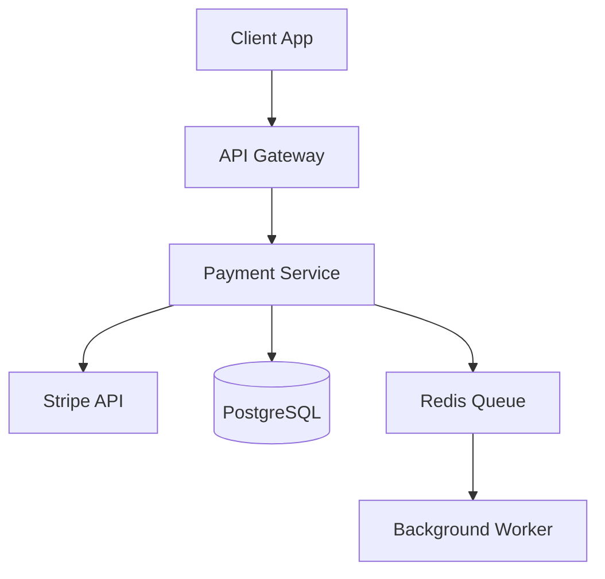

# SDLC Pipeline Usage Tutorial

## Mastering the 7-Phase Development Pipeline

Learn how to leverage the SDLC Pipeline System to transform chaotic development into a structured, automated, and quality-driven process.

## Table of Contents

1. [Introduction](#introduction)
2. [Setting Up Your First Pipeline](#setting-up-your-first-pipeline)
3. [Phase-by-Phase Walkthrough](#phase-by-phase-walkthrough)
4. [Managing Quality Gates](#managing-quality-gates)
5. [Handling Pipeline Issues](#handling-pipeline-issues)
6. [Advanced Pipeline Features](#advanced-pipeline-features)
7. [Real-World Scenario](#real-world-scenario)
8. [Troubleshooting Guide](#troubleshooting-guide)

## Introduction

### What You'll Learn
- Initialize and configure SDLC pipelines
- Execute each of the 7 development phases
- Manage quality gates and validations
- Handle errors and recover from failures
- Optimize pipeline performance

### Prerequisites
- Context Engineering Template installed
- Basic understanding of development workflows
- A feature ready for implementation

### Pipeline Overview
The SDLC Pipeline consists of 7 phases:
1. **Planning** - Requirements and estimation
2. **Design** - Architecture and specifications
3. **Implementation** - Code development
4. **Review** - Quality and compliance checks
5. **Testing** - Validation and verification
6. **Deployment** - Release management
7. **Documentation** - Knowledge capture

## Setting Up Your First Pipeline

### Step 1: Check Project Readiness
```bash
/analyze:sdlc-readiness
```

Expected output:
```
SDLC Readiness Check
====================
✅ Project structure valid
✅ Git repository initialized
✅ Package.json present
✅ Test framework configured
⚠️ No CI/CD configuration found (optional)

Status: Ready for SDLC Pipeline
Recommendation: Initialize pipeline with standard template
```

### Step 2: Initialize Pipeline

#### Option A: Direct Initialization
```bash
/sdlc "payment-gateway" --init
```

#### Option B: From Approved PRD (Recommended)
```bash
# First create and approve PRD
/manage:prd create "payment-gateway" --template=api
# ... edit PRD ...
/manage:prd approve "payment-gateway"
# Pipeline starts automatically
```

### Step 3: Choose Template
```bash
# Standard (Waterfall) - 10-12 days
/sdlc "payment-gateway" --init --template=standard

# Agile (Sprint-based) - 2-week sprints
/sdlc "payment-gateway" --init --template=agile

# Hotfix (Emergency) - 4 hours
/sdlc "critical-bug" --init --template=hotfix
```

### Step 4: Verify Initialization
```bash
/sdlc "payment-gateway" --status
```

Output:
```
Pipeline: payment-gateway
Template: standard
Status: Initialized
Current Phase: Planning (1/7)
Progress: 0%
Next Action: Execute planning phase
```

## Phase-by-Phase Walkthrough

### Phase 1: Planning (Day 1-2)

#### Execute Phase
```bash
/sdlc "payment-gateway" --phase=planning
```

#### What Happens
The system will:
1. Gather requirements interactively
2. Create Work Breakdown Structure (WBS)
3. Generate time estimates
4. Identify dependencies

#### Interactive Prompts
```
Planning Phase - payment-gateway
================================

Q1: What are the main functional requirements?
> Process credit card payments
> Handle refunds
> Store transaction history
> Generate receipts

Q2: What are the non-functional requirements?
> PCI compliance
> < 500ms response time
> 99.99% uptime

Q3: Any technical constraints?
> Must use Stripe API
> PostgreSQL database
> Node.js backend
```

#### Phase Output
```
✅ Planning Phase Complete

Generated Artifacts:
- requirements.md (15 requirements documented)
- wbs.json (23 tasks identified)
- estimates.md (Total: 10 days)
- dependencies.json (3 external dependencies)

Quality Gate: PASSED
- All requirements documented ✓
- Estimates reviewed ✓
- Resources allocated ✓
```

### Phase 2: Design (Day 3-5)

#### Execute Phase
```bash
/sdlc "payment-gateway" --phase=design
```

#### System Actions
1. **Architecture Design**


2. **API Specification**
```yaml
# Generated api-spec.yaml
openapi: 3.0.0
info:
  title: Payment Gateway API
  version: 1.0.0
paths:
  /payments:
    post:
      summary: Process payment
      requestBody:
        content:
          application/json:
            schema:
              type: object
              properties:
                amount: 
                  type: number
                currency:
                  type: string
                card_token:
                  type: string
```

3. **Database Schema**
```sql
-- Generated schema.sql
CREATE TABLE transactions (
    id UUID PRIMARY KEY,
    amount DECIMAL(10,2),
    currency VARCHAR(3),
    status VARCHAR(20),
    stripe_id VARCHAR(255),
    created_at TIMESTAMP,
    updated_at TIMESTAMP
);
```

#### Quality Gates
```
Design Phase Gates:
✅ Architecture documented
✅ API contracts defined
✅ Data model approved
✅ Security review passed
```

### Phase 3: Implementation (Day 6-10)

#### Execute Phase
```bash
/sdlc "payment-gateway" --phase=implementation
```

#### Automated Code Generation
The system generates boilerplate:

```javascript
// services/PaymentService.js (generated)
class PaymentService {
    constructor(stripeClient, database) {
        this.stripe = stripeClient;
        this.db = database;
    }

    async processPayment(amount, currency, cardToken) {
        // TODO: Implement payment processing
        // Requirements: FR1, FR2, NFR1
    }

    async refundPayment(transactionId, amount) {
        // TODO: Implement refund logic
        // Requirements: FR3, NFR2
    }
}
```

#### Development Tasks
```
Implementation Tasks:
1. [IN PROGRESS] Implement payment processing
2. [PENDING] Add refund functionality
3. [PENDING] Create transaction history
4. [PENDING] Generate receipts
5. [PENDING] Add error handling
6. [PENDING] Implement rate limiting
```

#### Monitor Progress
```bash
# Check implementation status
/sdlc "payment-gateway" --status

# View specific task
/sdlc "payment-gateway" --task-status=1
```

### Phase 4: Review (Day 11)

#### Execute Phase
```bash
/sdlc "payment-gateway" --phase=review
```

#### Review Checklist
```
Code Review Checklist:
========================
Security Review:
✅ No hardcoded secrets
✅ Input validation present
✅ SQL injection prevention
⚠️ Missing rate limiting on /payments

Performance Review:
✅ Database queries optimized
✅ Caching implemented
❌ Missing connection pooling

Architecture Review:
✅ Follows design patterns
✅ Proper error handling
✅ Logging implemented
```

#### Address Issues
```bash
# Fix identified issues
/implement:fix "Add rate limiting to payment endpoint"
/implement:enhancement "payment-gateway" "Add connection pooling"

# Re-run review
/sdlc "payment-gateway" --phase=review --retry
```

### Phase 5: Testing (Day 12-13)

#### Execute Phase
```bash
/sdlc "payment-gateway" --phase=testing
```

#### Test Execution
```
Running Test Suite:
==================
Unit Tests:
  ✅ PaymentService.processPayment (15 tests)
  ✅ PaymentService.refundPayment (8 tests)
  ✅ TransactionModel (12 tests)
  
Integration Tests:
  ✅ Stripe API integration (5 tests)
  ✅ Database operations (10 tests)
  ⚠️ Queue processing (2 failed)

Performance Tests:
  ✅ Response time: 245ms (avg)
  ✅ Throughput: 500 req/s
  ❌ Memory usage: 512MB (exceeds 400MB limit)

Coverage Report:
  Statements: 87% (174/200)
  Branches: 82% (41/50)
  Functions: 91% (20/22)
  Lines: 86% (150/174)
```

#### Fix Failing Tests
```bash
# Debug specific test
/support:issue-diagnose "Queue processing test failure"

# Fix and re-run
/implement:fix "Queue connection timeout issue"
/sdlc "payment-gateway" --phase=testing --retry
```

### Phase 6: Deployment (Day 14)

#### Execute Phase
```bash
/sdlc "payment-gateway" --phase=deployment
```

#### Deployment Process
```
Deployment Pipeline:
===================
1. Build application
   ✅ Compiling TypeScript
   ✅ Bundling assets
   ✅ Optimizing images

2. Run pre-deployment checks
   ✅ All tests passing
   ✅ Security scan clean
   ✅ Dependencies up-to-date

3. Deploy to staging
   ✅ Docker image built
   ✅ Pushed to registry
   ✅ Deployed to staging

4. Smoke tests
   ✅ Health check passing
   ✅ Basic payment flow works
   ✅ Monitoring active

5. Deploy to production
   ⏸️ Awaiting approval
```

#### Approve Production Deployment
```bash
/sdlc "payment-gateway" --approve-deployment
```

### Phase 7: Documentation (Day 15)

#### Execute Phase
```bash
/sdlc "payment-gateway" --phase=documentation
```

#### Generated Documentation
```
Documentation Generated:
=======================
API Documentation:
- OpenAPI specification
- Endpoint examples
- Authentication guide

User Guides:
- Integration tutorial
- Error handling guide
- Best practices

Technical Documentation:
- Architecture overview
- Database schema
- Deployment guide

Release Notes:
- New features
- Bug fixes
- Breaking changes
```

## Managing Quality Gates

### Understanding Gates
Quality gates ensure each phase meets standards before proceeding.

### Gate Configuration
```json
{
  "phase": "implementation",
  "gates": {
    "automated": {
      "code_coverage": 80,
      "linting_errors": 0,
      "tests_passing": 100
    },
    "manual": {
      "code_review": "approved",
      "security_review": "passed"
    }
  }
}
```

### Checking Gate Status
```bash
/sdlc "payment-gateway" --gate-status
```

Output:
```
Quality Gates - Implementation Phase
====================================
Automated Gates:
✅ Code coverage: 87% (required: 80%)
✅ Linting errors: 0 (required: 0)
❌ Tests passing: 95% (required: 100%)

Manual Gates:
✅ Code review: Approved by @john
⏸️ Security review: Pending

Status: BLOCKED - Fix failing tests
```

### Overriding Gates
Sometimes you need to proceed despite gate failures:

```bash
# Override with justification
/sdlc "payment-gateway" --override-gate=testing \
  --reason="Known flaky test, tracked in JIRA-123"
```

## Handling Pipeline Issues

### Common Issues and Solutions

#### Issue 1: Phase Timeout
```bash
Error: Planning phase exceeded 48-hour timeout
```

**Solution**:
```bash
# Extend timeout
/sdlc "payment-gateway" --extend-timeout=24h

# Or force complete
/sdlc "payment-gateway" --force-complete=planning
```

#### Issue 2: Blocked Pipeline
```bash
Error: Pipeline blocked at review phase
```

**Solution**:
```bash
# Check blockers
/sdlc "payment-gateway" --show-blockers

# Resolve and continue
/implement:fix "Address review comments"
/sdlc "payment-gateway" --continue
```

#### Issue 3: State Corruption
```bash
Error: Invalid pipeline state detected
```

**Solution**:
```bash
# Reset to last known good state
/manage:sdlc-pipeline reset "payment-gateway" --to-phase=implementation

# Or rebuild from history
/manage:sdlc-pipeline rebuild "payment-gateway"
```

## Advanced Pipeline Features

### Parallel Phase Execution
Run independent phases simultaneously:

```bash
# Configure parallel execution
/sdlc "payment-gateway" --config-parallel testing,documentation

# Execute in parallel
/sdlc "payment-gateway" --continue --parallel
```

### Custom Phase Injection
Add custom phases for specific needs:

```bash
# Add security audit phase
/sdlc "payment-gateway" --add-phase=security-audit \
  --after=review --duration=1d

# Execute custom phase
/sdlc "payment-gateway" --phase=security-audit
```

### Pipeline Composition
Combine multiple pipelines:

```bash
# Run quality pipeline after main pipeline
/sdlc "payment-gateway" --chain-pipeline=quality-assurance
```

### Automated Rollback
Configure automatic rollback on failure:

```bash
# Enable rollback
/sdlc "payment-gateway" --enable-rollback

# Define rollback strategy
/sdlc "payment-gateway" --rollback-strategy=last-stable
```

## Real-World Scenario

### Scenario: E-commerce Checkout Feature

Let's implement a complete checkout feature using SDLC pipeline.

#### Step 1: Create PRD
```bash
/manage:prd create "checkout-flow" --template=fullstack
```

Key requirements:
- Shopping cart management
- Payment processing
- Order confirmation
- Email notifications

#### Step 2: Approve and Start Pipeline
```bash
/manage:prd approve "checkout-flow"
# Pipeline auto-starts
```

#### Step 3: Planning Phase
```bash
/sdlc "checkout-flow" --status
# Currently in planning phase

# View generated tasks
/sdlc "checkout-flow" --show-tasks
```

Tasks generated:
1. Design cart database schema
2. Create cart API endpoints
3. Implement payment integration
4. Build checkout UI components
5. Add email service
6. Create order management

#### Step 4: Fast-Track Development
```bash
# Run all phases with monitoring
/sdlc "checkout-flow" --full --monitor
```

Real-time monitoring output:
```
Pipeline Progress: checkout-flow
================================
[Planning    ] ████████████████████ 100% ✅
[Design      ] ████████████████████ 100% ✅
[Implementation] ████████░░░░░░░░░░ 45% 🔄
  - Cart API: Complete
  - Payment: In Progress
  - UI: Pending
[Review      ] ░░░░░░░░░░░░░░░░░░░░ 0% ⏸️
[Testing     ] ░░░░░░░░░░░░░░░░░░░░ 0% ⏸️
[Deployment  ] ░░░░░░░░░░░░░░░░░░░░ 0% ⏸️
[Documentation] ░░░░░░░░░░░░░░░░░░░░ 0% ⏸️

Current: Implementing payment integration
ETA: 3 days remaining
```

#### Step 5: Handle Issues
```bash
# Test failure detected
/sdlc "checkout-flow" --status
# Blocked at testing phase

# Diagnose issue
/support:issue-diagnose "Payment test failing with timeout"

# Fix and retry
/implement:fix "Increase payment service timeout to 30s"
/sdlc "checkout-flow" --retry-phase=testing
```

#### Step 6: Complete Pipeline
```bash
# Final status check
/sdlc "checkout-flow" --status

Pipeline Complete! 🎉
====================
Duration: 12 days (estimated: 15 days)
Phases Completed: 7/7
Quality Score: 94/100

Deliverables:
- 6 API endpoints implemented
- 4 UI components created
- 95% test coverage achieved
- Full documentation generated

Next Steps:
- Monitor production metrics
- Gather user feedback
- Plan iteration 2
```

## Troubleshooting Guide

### Debug Mode
Enable detailed logging:
```bash
SDLC_DEBUG=true /sdlc "feature" --phase=implementation
```

### Common Commands
```bash
# View pipeline logs
/sdlc "feature" --logs

# Check phase history
/sdlc "feature" --history

# Export pipeline report
/support:sdlc-report "feature" --format=pdf

# Archive completed pipeline
/manage:sdlc-pipeline archive "feature"
```

### Recovery Procedures

#### From Failed Phase
```bash
# Identify failure point
/sdlc "feature" --diagnose

# Fix issues
/implement:fix "Resolve identified issues"

# Resume from failure point
/sdlc "feature" --resume
```

#### From Corrupted State
```bash
# Backup current state
cp -r .claude/sdlc/pipelines/feature .claude/sdlc/pipelines/feature.backup

# Restore from checkpoint
/manage:sdlc-pipeline restore "feature" --checkpoint=phase-3

# Verify restoration
/sdlc "feature" --validate
```

## Best Practices

### 1. Start with PRDs
Always begin with a well-defined PRD for automatic requirement parsing.

### 2. Monitor Progress
```bash
# Set up monitoring
/sdlc "feature" --monitor --notify=slack
```

### 3. Regular Checkpoints
```bash
# Create checkpoint after critical phases
/sdlc "feature" --checkpoint --name="post-implementation"
```

### 4. Document Decisions
```bash
# Add decision record
/sdlc "feature" --add-note="Chose PostgreSQL over MySQL for JSON support"
```

### 5. Learn from Metrics
```bash
# Analyze pipeline performance
/support:sdlc-report "feature" --metrics
```

## Summary

You've learned to:
- ✅ Initialize and configure SDLC pipelines
- ✅ Execute all 7 development phases
- ✅ Manage quality gates effectively
- ✅ Handle errors and recovery
- ✅ Use advanced pipeline features

The SDLC Pipeline transforms development from chaos to structure, ensuring quality and predictability.

## Next Steps

1. Try different pipeline templates (agile, hotfix)
2. Customize pipelines for your workflow
3. Integrate with CI/CD systems
4. Explore [Agent Orchestration](agent-orchestration.md)

## Resources

- [SDLC Pipeline Guide](../guides/SDLC_GUIDE.md)
- [Pipeline Templates](../../.claude/sdlc/templates/)
- [Quality Gate Configuration](../guides/SDLC_GUIDE.md#quality-gates-management)
- [Troubleshooting Guide](../guides/SDLC_GUIDE.md#troubleshooting)