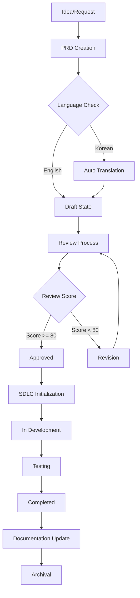

# PRD Lifecycle Workflow

Comprehensive workflow for managing Product Requirements Documents through their entire lifecycle, from initial creation to final archival.

## Workflow Overview



## Phase 1: PRD Creation

### Trigger
```bash
/manage:prd create "[feature-name]" --template=[type]
```

### Actions
1. **Template Selection**
   - Load appropriate template (standard/api/frontend/fullstack)
   - Pre-populate metadata fields
   - Create in `docs/prd/draft/`

2. **Initial Structure**
   ```markdown
   # PRD: [Feature Name]
   
   ## Metadata
   - ID: PRD-YYYY-XXX
   - Created: [Date]
   - Status: Draft
   - Author: [User]
   ```

3. **Guidance Provision**
   - Display template sections
   - Provide examples for each section
   - Link to PRD best practices

## Phase 2: Language Processing

### Automatic Detection
```javascript
function processLanguage(content) {
  const language = detectLanguage(content);
  
  if (language === 'ko') {
    // Korean content detected
    return {
      action: 'translate',
      source: 'ko',
      target: 'en'
    };
  }
  
  return {
    action: 'proceed',
    language: 'en'
  };
}
```

### Translation Workflow
1. **Korean Input Processing**
   - Save original as `{name}_original_ko.md`
   - Translate to English using AI service
   - Validate translation quality
   - Save English version as primary

2. **Quality Assurance**
   - Check technical term accuracy
   - Verify requirement clarity
   - Maintain formatting consistency

## Phase 3: Review Process

### Trigger
```bash
/support:prd-review "[feature-name]"
```

### Review Checklist
```yaml
Completeness Check:
  - Executive Summary: required
  - Problem Statement: required
  - Success Metrics: required
  - Requirements: required
  - Acceptance Criteria: required
  
Quality Assessment:
  - Clarity Score: 0-100
  - Feasibility Score: 0-100
  - Completeness Score: 0-100
  - Risk Assessment: 0-100
  
Overall Score: weighted_average
Passing Score: >= 80
```

### Review Outcomes
- **Pass (Score >= 80)**: Move to Approved
- **Fail (Score < 80)**: Return for Revision
- **Conditional Pass**: Approve with required changes

## Phase 4: Approval & SDLC Integration

### Approval Process
```bash
/manage:prd approve "[feature-name]"
```

### Automatic Actions
1. **State Transition**
   - Move from `review/` to `approved/`
   - Update status metadata
   - Log approval timestamp

2. **SDLC Pipeline Initialization**
   ```bash
   # Automatically triggered
   /sdlc "[feature-name]" --init --from-prd="docs/prd/approved/[feature-name].md"
   ```

3. **Task Generation**
   - Convert requirements to tasks
   - Map to SDLC phases
   - Create dependency graph

## Phase 5: Development Tracking

### Status Synchronization
```yaml
PRD Status Updates:
  SDLC_Started: 
    - PRD moves to in-development/
    - Status: "In Development"
  
  Phase_Completed:
    - Update progress percentage
    - Log phase completion
  
  Testing_Started:
    - Add test results link
    - Update validation status
```

### Progress Monitoring
```bash
/manage:prd status "[feature-name]"

# Output:
PRD: User Authentication
Status: In Development
Progress: 65% (Implementation Phase)
SDLC Link: Active
Started: 2024-01-15
Est. Completion: 2024-02-01
```

## Phase 6: Completion & Documentation

### Completion Trigger
When SDLC pipeline completes successfully

### Automatic Documentation Updates
1. **Release Notes Generation**
   ```markdown
   ## Release v2.1.0
   
   ### New Features
   - [Feature Name]: [Description from PRD]
   
   ### Requirements Implemented
   - [List from PRD]
   
   ### Success Metrics
   - [Metrics from PRD]
   ```

2. **Guide Updates**
   - User guide additions
   - API documentation
   - Developer guide updates

3. **Metrics Collection**
   ```yaml
   Completion Metrics:
     - Total Duration: X days
     - Actual vs Estimated: Y%
     - Requirement Changes: Z
     - Review Iterations: N
   ```

## Phase 7: Archival

### Archival Process
```bash
/manage:prd archive "[feature-name]"
```

### Archive Structure
```
docs/prd/archived/
└── 2024/
    └── 01/
        ├── user-authentication.md
        ├── user-authentication_metrics.json
        └── user-authentication_original_ko.md
```

### Metadata Preservation
```json
{
  "id": "PRD-2024-001",
  "feature": "User Authentication",
  "created": "2024-01-01",
  "completed": "2024-02-01",
  "duration_days": 31,
  "sdlc_phases": 7,
  "review_score": 92,
  "changes_count": 3,
  "success_metrics_met": true
}
```

## Automation Scripts

### State Transition Handler
```javascript
async function transitionPRDState(prdName, fromState, toState) {
  // Validate transition
  if (!isValidTransition(fromState, toState)) {
    throw new Error(`Invalid transition: ${fromState} -> ${toState}`);
  }
  
  // Move file
  const sourcePath = `docs/prd/${fromState}/${prdName}.md`;
  const targetPath = `docs/prd/${toState}/${prdName}.md`;
  await moveFile(sourcePath, targetPath);
  
  // Update metadata
  await updatePRDMetadata(prdName, { 
    status: toState,
    transitioned_at: new Date()
  });
  
  // Trigger next actions
  await triggerStateActions(prdName, toState);
}
```

### Integration Points

#### SDLC Connection
- PRD approval triggers SDLC initialization
- SDLC progress updates PRD status
- SDLC completion triggers documentation

#### Documentation System
- Release notes auto-generation
- Guide updates based on PRD
- API documentation from specifications

#### Metrics & Reporting
- Cycle time tracking
- Success rate monitoring
- Requirement stability metrics

## Error Handling

### Common Scenarios
1. **Translation Failure**
   - Fallback to manual review
   - Flag for human translation
   - Proceed with original language

2. **Review Score Below Threshold**
   - Detailed feedback generation
   - Revision guidance
   - Re-review scheduling

3. **SDLC Integration Failure**
   - Manual initialization option
   - Error logging
   - Rollback procedures

## Best Practices

1. **Start with the right template** - Saves time and ensures completeness
2. **Write in preferred language** - Auto-translation handles conversion
3. **Iterate through reviews** - Don't wait for perfection
4. **Link dependencies explicitly** - Helps with planning
5. **Update PRD during development** - Keep it as living documentation
6. **Archive promptly** - Maintains clean workspace

## Success Metrics

Track these metrics for workflow optimization:
- Average time from creation to approval
- Review iteration count
- Translation accuracy rate
- SDLC integration success rate
- Documentation update completeness
- Archive retrieval frequency