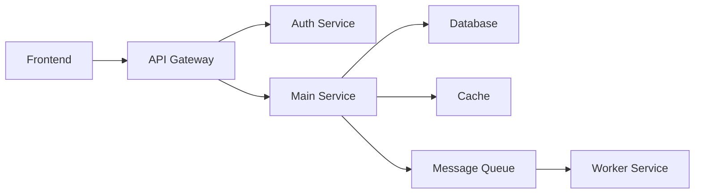

# PRD: [Full-Stack Feature Name]

## Executive Summary

**Feature**: [End-to-end feature description]  
**Stack Coverage**: Frontend + Backend + Database + Infrastructure  
**Priority**: P[0/1/2]  
**Target Release**: [Version/Date]  
**Architecture Pattern**: Monolithic / Microservices / Serverless  
**Document Status**: Draft  

## Problem Statement

### End-to-End Context
[Describe the complete problem from user interface to data persistence]

### Current System Limitations
- **Frontend**: [Current UI/UX limitations]
- **Backend**: [API or service limitations]
- **Database**: [Data model or performance issues]
- **Infrastructure**: [Scaling or deployment challenges]

### Business Impact
[How does solving this problem impact the business across all layers?]

## Goals & Success Metrics

### System-Wide Goals
1. Deliver seamless user experience from UI to data layer
2. Ensure system scalability across all components
3. Maintain consistency between frontend and backend

### Integrated Success Metrics
- **User Metrics**: Engagement, satisfaction, task completion
- **Performance Metrics**: End-to-end latency, throughput
- **System Metrics**: Uptime, error rates, resource utilization
- **Business Metrics**: Conversion, revenue impact, cost efficiency

## User Journey & System Flow

### Complete User Journey
```
User Action → Frontend → API Gateway → Backend Service → Database
     ↑                                                        ↓
     ←──────────── Response Path ←─────────────────────────←
```

### Detailed Flow

#### Step 1: User Interaction
**Frontend Action**: [User clicks button/submits form]
```javascript
// Frontend code example
const handleSubmit = async (data) => {
  const response = await api.post('/endpoint', data);
  updateUI(response);
};
```

#### Step 2: API Request
**Backend Processing**: [Validate, process, persist]
```javascript
// Backend code example
app.post('/api/endpoint', async (req, res) => {
  const validated = validate(req.body);
  const result = await service.process(validated);
  res.json(result);
});
```

#### Step 3: Data Persistence
**Database Operation**: [CRUD operations]
```sql
-- Database schema example
CREATE TABLE resource (
  id UUID PRIMARY KEY,
  user_id UUID REFERENCES users(id),
  data JSONB,
  created_at TIMESTAMP DEFAULT NOW()
);
```

## Full-Stack Requirements

### Frontend Requirements

#### UI Components
- **Component Tree**:
  ```
  App
  ├── Header
  ├── Navigation
  ├── MainContent
  │   ├── Feature Component
  │   └── Subcomponents
  └── Footer
  ```

#### State Management
```javascript
// Global state structure
{
  auth: { user, token, permissions },
  feature: { data, loading, error },
  ui: { theme, language, notifications }
}
```

#### User Interface Specs
- Responsive design (mobile-first)
- Accessibility (WCAG AA)
- Internationalization ready
- Progressive enhancement

### Backend Requirements

#### API Design
```yaml
/api/v1/resource:
  GET:
    - List resources with pagination
    - Filter and sort capabilities
  POST:
    - Create new resource
    - Validation and sanitization
  
/api/v1/resource/{id}:
  GET:
    - Retrieve single resource
  PUT:
    - Update resource
  DELETE:
    - Soft delete resource
```

#### Service Architecture
```
┌─────────────┐     ┌─────────────┐     ┌─────────────┐
│   API       │────▶│  Business   │────▶│    Data     │
│  Gateway    │     │   Logic     │     │   Access    │
└─────────────┘     └─────────────┘     └─────────────┘
       │                   │                    │
       ▼                   ▼                    ▼
┌─────────────┐     ┌─────────────┐     ┌─────────────┐
│    Auth     │     │   Events    │     │  Database   │
│  Service    │     │    Bus      │     │             │
└─────────────┘     └─────────────┘     └─────────────┘
```

#### Business Logic
- Input validation rules
- Business rule processing
- Transaction management
- Error handling strategy

### Database Requirements

#### Data Model
```sql
-- Core entities
CREATE TABLE users (
  id UUID PRIMARY KEY DEFAULT uuid_generate_v4(),
  email VARCHAR(255) UNIQUE NOT NULL,
  profile JSONB,
  created_at TIMESTAMP DEFAULT NOW(),
  updated_at TIMESTAMP DEFAULT NOW()
);

CREATE TABLE resources (
  id UUID PRIMARY KEY DEFAULT uuid_generate_v4(),
  user_id UUID REFERENCES users(id),
  name VARCHAR(255) NOT NULL,
  metadata JSONB,
  status VARCHAR(50) DEFAULT 'active',
  created_at TIMESTAMP DEFAULT NOW()
);

-- Indexes for performance
CREATE INDEX idx_resources_user_id ON resources(user_id);
CREATE INDEX idx_resources_status ON resources(status);
CREATE INDEX idx_resources_metadata ON resources USING GIN(metadata);
```

#### Data Access Patterns
- Read/Write ratio: [80/20]
- Query patterns: [List common queries]
- Caching strategy: Redis for hot data
- Replication: Read replicas for scaling

### Infrastructure Requirements

#### Deployment Architecture
```yaml
Production Environment:
  Frontend:
    - CDN: CloudFront/Cloudflare
    - Static Hosting: S3/Vercel
  
  Backend:
    - Container: Docker
    - Orchestration: Kubernetes/ECS
    - Auto-scaling: Based on CPU/Memory
  
  Database:
    - Primary: PostgreSQL RDS
    - Cache: Redis ElastiCache
    - Search: Elasticsearch
  
  Supporting Services:
    - Queue: SQS/RabbitMQ
    - Storage: S3
    - Monitoring: DataDog/CloudWatch
```

#### DevOps Requirements
- CI/CD pipeline configuration
- Infrastructure as Code (Terraform/CloudFormation)
- Monitoring and alerting setup
- Backup and disaster recovery

## Integration Architecture

### Internal Integrations


### External Integrations
- **Payment Gateway**: Stripe/PayPal integration
- **Email Service**: SendGrid/SES
- **Analytics**: Google Analytics/Mixpanel
- **Storage**: AWS S3/Google Cloud Storage
- **CDN**: CloudFront/Fastly

### API Contracts

#### Frontend-Backend Contract
```typescript
// Shared types
interface Resource {
  id: string;
  name: string;
  metadata: Record<string, any>;
  createdAt: Date;
  updatedAt: Date;
}

interface ApiResponse<T> {
  data: T;
  error?: string;
  pagination?: {
    page: number;
    limit: number;
    total: number;
  };
}
```

## Security Requirements

### Security Layers

#### Frontend Security
- Content Security Policy (CSP)
- XSS protection
- HTTPS only
- Secure cookie handling
- Input sanitization

#### Backend Security
- Authentication: JWT/OAuth2
- Authorization: RBAC/ABAC
- Rate limiting per endpoint
- Input validation and sanitization
- SQL injection prevention
- API key management

#### Database Security
- Encryption at rest
- Encryption in transit
- Access control (IAM)
- Audit logging
- Regular backups
- PII data handling

#### Infrastructure Security
- VPC and security groups
- WAF rules
- DDoS protection
- Secrets management (Vault/KMS)
- Container security scanning

## Performance Requirements

### End-to-End Performance
- **Page Load Time**: < 2s (First Contentful Paint)
- **API Response Time**: P95 < 200ms
- **Database Query Time**: P95 < 50ms
- **Time to Interactive**: < 3s
- **Throughput**: 10,000 concurrent users

### Performance Optimization

#### Frontend Optimization
- Code splitting and lazy loading
- Image optimization (WebP, lazy loading)
- Bundle size < 300KB
- Service Worker for caching
- CDN for static assets

#### Backend Optimization
- Connection pooling
- Query optimization
- Caching strategy (Redis)
- Async processing for heavy tasks
- Horizontal scaling ready

#### Database Optimization
- Index optimization
- Query plan analysis
- Partitioning strategy
- Read replica usage
- Connection pooling

## Testing Strategy

### Testing Pyramid
```
        /\
       /E2E\      (5%)
      /------\
     /Integration\ (20%)
    /------------\
   /   Unit Tests  \ (75%)
  /------------------\
```

### Test Coverage by Layer

#### Frontend Testing
- Unit tests: Components, utilities (>80%)
- Integration tests: Component interactions
- E2E tests: Critical user journeys
- Visual regression: Screenshot testing
- Performance testing: Lighthouse CI

#### Backend Testing
- Unit tests: Business logic (>80%)
- Integration tests: API endpoints
- Contract tests: API contracts
- Load testing: Performance validation
- Security testing: OWASP Top 10

#### Database Testing
- Migration testing
- Data integrity tests
- Performance testing
- Backup/restore testing

## Development Workflow

### Development Phases

#### Phase 1: Foundation (Week 1-2)
- Database schema design and migration
- API scaffold and basic endpoints
- Frontend component structure
- CI/CD pipeline setup

#### Phase 2: Core Features (Week 3-4)
- Implement business logic
- Frontend-backend integration
- Authentication/authorization
- Basic testing

#### Phase 3: Advanced Features (Week 5-6)
- Complex workflows
- Real-time features
- Performance optimization
- Error handling

#### Phase 4: Polish & Deploy (Week 7-8)
- UI/UX polish
- Performance tuning
- Security hardening
- Production deployment

### Team Collaboration
```
Frontend Developer ←→ Full-Stack Lead ←→ Backend Developer
        ↓                    ↓                    ↓
    UX Designer         DevOps Engineer      DBA/Data Engineer
```

## Monitoring & Observability

### Monitoring Stack
```yaml
Metrics:
  - Application: Custom metrics
  - Infrastructure: CPU, Memory, Disk
  - Business: User actions, conversions

Logging:
  - Centralized: ELK Stack
  - Structured: JSON format
  - Retention: 30 days

Tracing:
  - Distributed: Jaeger/Zipkin
  - Request flow: End-to-end
  - Performance: Bottleneck identification

Alerting:
  - Critical: PagerDuty
  - Warning: Slack
  - Info: Email
```

### Key Dashboards
1. **User Experience**: Page load, errors, user flows
2. **API Health**: Response times, error rates, throughput
3. **Infrastructure**: Resource utilization, scaling events
4. **Business Metrics**: Feature adoption, conversion rates

## Deployment Strategy

### Deployment Pipeline
```
Code → Build → Test → Stage → Production
  ↓      ↓      ↓       ↓         ↓
 Git   Docker  Jest  Staging   Blue/Green
               Cypress  E2E      Deployment
```

### Rollout Plan
1. **Feature Flags**: Gradual feature enablement
2. **Canary Deployment**: 5% → 25% → 50% → 100%
3. **Rollback Strategy**: Instant rollback capability
4. **Database Migrations**: Backward compatible

## Documentation Requirements

### Technical Documentation
- [ ] API documentation (OpenAPI/Swagger)
- [ ] Database schema documentation
- [ ] Architecture decision records (ADRs)
- [ ] Deployment runbooks
- [ ] Troubleshooting guides

### User Documentation
- [ ] User guides
- [ ] Admin documentation
- [ ] API integration guides
- [ ] Video tutorials

## Cost Analysis

### Infrastructure Costs
- **Compute**: $[X]/month
- **Storage**: $[Y]/month
- **Database**: $[Z]/month
- **CDN/Bandwidth**: $[A]/month
- **Third-party Services**: $[B]/month
- **Total Estimated**: $[Total]/month

### ROI Calculation
- Development Cost: $[X]
- Monthly Operating Cost: $[Y]
- Expected Revenue Impact: $[Z]
- Payback Period: [N] months

## Risk Assessment

### Technical Risks
| Risk | Impact | Probability | Mitigation |
|------|--------|------------|------------|
| Scaling issues | High | Medium | Load testing, auto-scaling |
| Data loss | High | Low | Backups, disaster recovery |
| Security breach | High | Low | Security audit, penetration testing |
| Integration failure | Medium | Medium | Circuit breakers, fallbacks |

## Open Questions

1. [Architectural decision pending]
2. [Technology choice to finalize]
3. [Business requirement clarification needed]

---

**Document History**
| Version | Date | Author | Changes |
|---------|------|--------|---------|
| 1.0 | [Date] | [Name] | Initial full-stack PRD |